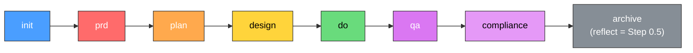

# Datarim

**A universal iterative workflow framework for AI-assisted project execution — from requirements to completion.**

[](VERSION)
[](LICENSE)
[](https://securityscorecards.dev/viewer/?uri=github.com/Arcanada-one/datarim)

**Website:** [datarim.club](https://datarim.club) — releases, changelog, and the full command/skill/agent catalogue.

---

## What is Datarim?

Most work with AI assistants is unstructured. You give a prompt, get a result, move
on. There is no requirements analysis, no planning phase, no quality assurance, no
reflection. The result is inconsistent quality, skipped steps, and zero institutional
learning. Every task starts from scratch, repeating the same mistakes from yesterday.

Datarim fixes this by providing a complete iterative pipeline for any project type.
It includes 19 specialized agents, 79 reusable skills, and 29 commands that guide
work through a structured process: requirements gathering, planning, design,
execution, quality assurance, compliance, reflection, and archival. The pipeline is
complexity-aware — a quick fix does not go through the same process as a major
project. Datarim routes each task through exactly the stages it needs.

Datarim is not limited to software development. Research papers, technical
documentation, legal documents, project management, content creation — any work that
benefits from structured iteration can use the framework. The agents and skills adapt
to the domain. The process stays the same.

Runtime-agnostic — Datarim runs under Claude Code, Codex CLI, and Cursor — it works
for any project and any domain. There are no hardcoded paths, no vendor lock-in, no
project-specific assumptions. And it is
self-evolving: after every completed task, the framework analyzes what worked, what
failed, and proposes improvements to its own agents, skills, and rules. The name
"Datarim" comes from *data + rim* — the edge where structured data meets creative
work.

---

## Pipeline

### Full Pipeline (Mermaid)


```mermaid
graph LR
    init["init"] --> prd["prd"]
    prd --> plan["plan"]
    plan --> design["design"]
    design --> do["do"]
    do --> qa["qa"]
    qa --> compliance["compliance"]
    compliance --> archive["archive<br>(reflect = Step 0.5)"]

    style init fill:#4a9eff,stroke:#333,color:#fff
    style prd fill:#ff6b6b,stroke:#333,color:#fff
    style plan fill:#ffa94d,stroke:#333,color:#fff
    style design fill:#ffd43b,stroke:#333,color:#000
    style do fill:#69db7c,stroke:#333,color:#000
    style qa fill:#da77f2,stroke:#333,color:#fff
    style compliance fill:#e599f7,stroke:#333,color:#000
    style archive fill:#868e96,stroke:#333,color:#fff
```

Reflection runs automatically inside `archive` as mandatory Step 0.5 since v1.10.0.

### Complexity Routing (ASCII)

Not every task needs every stage. Datarim routes tasks based on complexity:

```
L1 (Quick Fix):    init ──────────────────────────── do ──── archive
L2 (Enhancement):  init ── [prd] ── plan ──────────── do ── [qa] ── archive
L3 (Feature):      init ── prd ── plan ── design ──── do ── qa ── [compliance] ── archive
L4 (Major):        init ── prd ── plan ── design ── phased-do ── qa ── compliance ── archive
```

Stages in `[brackets]` are conditional — included when the agent determines they add value. `archive` always runs reflection internally as mandatory Step 0.5.

### Complexity Routing Table

| Level | Name | Scope | LOC Estimate | Pipeline |
|-------|------|-------|-------------|----------|
| L1 | Quick Fix | 1 file | < 50 | `init` → `do` → `archive` |
| L2 | Enhancement | 2–5 files | < 200 | `init` → `[prd]` → `plan` → `do` → `[qa]` → `archive` |
| L3 | Feature | 5–15 files | 200–1000 | `init` → `prd` → `plan` → `design` → `do` → `qa` → `[compliance]` → `archive` |
| L4 | Major | 15+ files | > 1000 | `init` → `prd` → `plan` → `design` → `phased-do` → `qa` → `compliance` → `archive` |

---

## Features

- **19 specialized agents** — planner, architect, developer, reviewer, compliance,
  code-simplifier, strategist, devops, writer, editor, skill-creator, optimizer,
  librarian, security, SRE, tester, researcher, and peer-reviewer (Layer 2/3
  cross-Claude-family fallback). Each agent has a defined role, capabilities,
  and the stages where it operates.

- **79 reusable skills** — modular knowledge units that agents load on demand,
  covering everything from testing methodology to security hardening to content
  creation workflows and structured research.

- **29 commands** — 8 pipeline stages + /dr-auto autonomous mode + /dr-verify standalone + /dr-quick fast-lane + /dr-wizard interactive task-spec wizard, 3 content (write, edit, publish), 5 framework
  and knowledge management (addskill, doctor, optimize, dream, **plugin** v1.23.0+), utilities (status, next,
  help), and 2 standalone tools (factcheck, humanize).

- **8-stage complexity-aware pipeline** — tasks flow through exactly the stages they
  need. No unnecessary ceremony for simple fixes, full rigor for major changes.
  Reflection runs automatically inside `archive` as mandatory Step 0.5.

- **Backlog management** — two-file architecture for task tracking. Active items in
  `backlog.md`, completed history in `backlog-archive.md`. Pick tasks from backlog
  with `/dr-init` or add new ones as you work.

- **Plugin system (v1.23.0+)** — opt-in extension mechanism. `datarim-core`
  ships built-in; additional skills/agents/commands/templates are enabled via
  `/dr-plugin enable <source>` against a `plugin.yaml` manifest. Runtime symlinks
  per-plugin namespace under `.datarim-runtime/<category>/<plugin-id>/`; root-position via
  `overrides:`. `dr-plugin doctor` runs 9 health checks (manifest-syntax,
  inventory-consistency, broken-symlinks, orphan-files, override-integrity,
  dependency-graph, git-state, snapshot-cleanup, skill-registry).

- **Reference plugin: dr-orchestrate (v2.5.0+)** — first non-core plugin.
  Tmux-based self-driving Datarim pipeline runner. Phase 1 ships a lean
  rule-based runner with security floor (whitelist, byte-0x1b escape block,
  500 ms micro + 60 s decision cooldown, 5-violations/hr → 1 h pane block,
  fail-closed); Phase 2 (v2.4.0+) adds a multi-backend subagent inference; v2.5.0 ships a bot-interaction interface (OpenAPI 3.1 + adnanh/webhook + HMAC-SHA256/Redis outbound, gated activation). Phase 2 baseline
  layer (claude → codex → cursor, lenient JSON parse, FD-3 close, fail-
  closed threshold gate) for unknown prompts and bumps plugin autonomy from
  L1 (manual) to L2 (assisted). Flock-race-safe cooldown on Linux, audit
  schema v2 with confidence + backend metadata, hash-only matched text
  invariant preserved. Phase 3 adds an L4 baseline with actor/session-bound
  Save-as-rule confirmation, exact learned matches, 24-hour re-validation,
  and an immutable seven-day TTL. Learned actions remain constrained by
  per-space policy and the hard-gated floor. Install via `dr-plugin enable dr-orchestrate`. See
  `plugins/dr-orchestrate/README.md`.
  Default-off context-window self-clearing for orchestrated Claude Code and
  Codex sessions preserves task pointers and snapshot phase before fixed
  `/compact` or `/clear`, then resumes with snapshot-first `/dr-next`.

- **Explicit project scope** — Datarim instructions, skills, and task state
  belong to the installed project. Native agents perform bounded reads and
  reviews according to project policy. Coworker and RTK are retired runtime
  dependencies. Optional Jev classification has separate native hooks for
  Claude, Codex, and Cursor; see the [host/project guide](documentation/how-to/host-jev-with-project-datarim.md).

- **Autonomous Agent Operating Rules contract** — the core ships
  `dev-tools/rules/fb-rules.yaml` (FB-1..FB-8 policy block with
  `enforcement_layer` / `tier` / `default_action` / `reversibility_required` /
  `audit_required` / `conflicts_with_law` + `hard_gated_actions:` list) and a
  `dev-tools/fb-policy-loader.sh` `load_fb_policy()` entry point; the
  `dr-orchestrate` plugin's `rules_loader.sh` is a thin shim that delegates
  to it. Consumers mirror the canonical rule text in their own ecosystem
  `AGENTS.md` (Datarim ships the contract surface, not the canonical text —
  the text is ecosystem-owned and audit-tagged per consumer). See
  `dev-tools/rules/fb-rules.yaml` header and the framework's `AGENTS.md`
  § Autonomous Agent Operating Rules (cross-link).

- **Self-evolving framework** — after every task, `/dr-archive` Step 0.5 (reflecting
  skill) analyzes outcomes and proposes improvements to agents, skills, and framework
  rules. The framework gets better with use.

- **Consilium: multi-agent panel discussions** — for critical decisions, assemble a
  panel of relevant agents to debate trade-offs and reach a recommendation before
  committing to a direction.

- **Discovery: structured requirements interviews** — systematic elicitation of
  requirements through guided questions, ensuring nothing important is missed before
  planning begins.

- **Multi-layer QA** — verification happens at multiple stages: PRD validation,
  design review, plan verification, code review, and compliance checking. Defects
  are caught early, not in production.

- **Tri-layer self-verification (`/dr-verify`)** — on-demand standalone verification
  of any pipeline artifact. Layer 1 deterministic floor (shell pipeline, no LLM
  cost) → Layer 2 native peer-review in a clean selected-agent context → Layer 3
  native runtime dispatch (Claude 3-agent parallel, Codex single-prompt fallback).
  Layer 2 provider auto-resolves via a native-only chain (CLI flag → per-project
  `datarim/config.yaml` → per-user XDG → cross-Claude-family subagent fallback →
  same-model isolated last resort), so `/dr-verify {TASK-ID}` works zero-flag
  without any external API key. Artifact review, AC verification, hidden-gap
  discovery, architecture judgment, and semantic QA MUST NOT use `coworker`.
  Findings carry `source_layer` + `peer_review_mode` (`cross_claude_family` /
  `same_model_isolated`) tags for tri-layer provenance and dispatch-class audit.
  `--floor-only` for fast pre-merge gating with zero LLM cost.

- **Native shell utilities** — no external MCP server dependencies required. All
  core functionality works through Claude Code's built-in tools and shell access.

- **Fact-checking and AI text humanization** — specialized skills for content work:
  verify claims against sources, remove AI writing artifacts, preserve the author's
  natural voice.

- **Strategic advisor gate** — before committing to major work, the strategist
  evaluates value, risk, and cost. `/dr-plan` also requires and logs this review
  at any complexity when the entire scope only removes redundancy, dead code,
  or duplicate surfaces without adding behavior. Ambiguous cleanup claims fail
  closed; a valid `GO` unlocks only the next existing planning gate.

- **Project scaffolding** — `/dr-init create project "Name"` creates a complete
  project structure: AGENTS.md with Laws of Robotics and Datarim pipeline, documentation/
  stubs (architecture, testing, deployment, gotchas), ephemeral working directories,
  and Datarim workflow state. Tech stack auto-detected. Idempotent — safe to run on
  existing projects.

- **Universal compatibility** — works for any project, any domain, any tech stack.
  Software, research, documentation, legal work, project management — the framework
  adapts to what you are building.

---

## Runtimes

One project install serves Codex, Claude Code and Cursor. Each client finds the
`/dr-*` commands in its own project-local directory; every command tells the
agent where this project's runtime is and to read the framework rules from it.
Nothing is added to `AGENTS.md`, `CLAUDE.md` or `.gitignore`, so Datarim is
loaded only when you run a command, and nothing it writes appears in
`git status`. Coworker and RTK are not required. Per-client details:
[multi-runtime](documentation/how-to/multi-runtime.md).

## Prerequisites

- Python 3.10 or newer and Git.
- An installed, authenticated agent client: Codex CLI, Claude Code, or Cursor CLI.
- A project directory you explicitly want to enable.
- For optional Jev classification: a separate Jev API key for each host.

## Operating Model

This repository is the framework source. Changes are reviewed and merged here;
projects receive a pinned copy under `.datarim-runtime/`. No runtime is installed
in user home directories, and no shell startup file is modified. Task knowledge
belongs to the consumer project, never to this source repository.

## Installation

Start with the walkthrough for your intended setup:

- [Initialize Datarim without Jev](documentation/tutorials/initialize-datarim.md)
- [Initialize Datarim together with Jev](documentation/tutorials/initialize-datarim-with-jev.md)
- [Use Jev on its own, without Datarim](documentation/how-to/jev-without-datarim.md)
- [Configure and use Jev](documentation/how-to/configure-and-use-jev.md)
- [Use host Jev with project-local Datarim](documentation/how-to/host-jev-with-project-datarim.md)
- [Jev command reference](documentation/reference/jev-cli.md)

Jev does not require Datarim. Routing, the ledger and the deterministic safety
floor work on a machine that has never installed the framework; what a project
catalogue adds is skill, agent, command and template selection on top of the
model tier.

```sh
./install.sh --project /absolute/path/to/project --init --with-jev
cd /absolute/path/to/project
source .datarim-runtime/activate.sh
jev doctor
```

The installer preserves existing project instructions, creates a protected empty
key file, and refuses conflicts. Add the host's key using an editor, then run
`jev doctor --api` to check the connection. Omit `--with-jev` to use Datarim alone.

All four entrypoints share project checks and the same configuration:

```sh
jevcodex "Investigate the failing test"
jevclaude "Review this change"
jevcursor "Explain this module"
jev --agent=codex "Investigate the failing test"
```

Run `./update.sh --project /absolute/path/to/project --with-jev` from the reviewed
source checkout to update a project. Follow the walkthrough for backup handling
and uninstall. Activation is limited to the current shell; each invocation
checks its actual working directory, including after you leave the project.

---

## Quick Start

```bash
# Navigate to your project
cd your-project

# Install Datarim into this project (commands, runtime, local task state)
/path/to/datarim/install.sh --project "$PWD" --init
# It does not modify AGENTS.md, CLAUDE.md or .gitignore; git status stays clean.

# Start Claude Code
claude

# Option A: scaffold a new project structure (AGENTS.md, documentation/, datarim/)
/dr-init create project "My API Service"

# Initialize a task — Datarim assigns complexity and routes the pipeline
/dr-init Add user authentication with JWT

# The framework tells you what stage comes next.
# For an L3 task, the pipeline would be:
/dr-prd        # Generate product requirements document
/dr-plan       # Create implementation plan
/dr-design     # Explore architectural decisions
/dr-do         # Implement with TDD
/dr-qa         # Run quality assurance checks
/dr-archive    # Reflection (Step 0.5: analyze what worked and what to improve) + archive

# Check progress at any time
/dr-status

# Resume after a break
/dr-next
```

Each command guides you through its stage. The framework tracks state between
commands and tells you what to do next.

### Non-Programming Example

```bash
# Example: Writing a research literature review
/dr-init Write literature review on quantum error correction (2020-2026)

/dr-prd        # Define scope: target journals, databases, citation format, minimum sources
/dr-plan       # Section outline, source allocation per section
/dr-do         # Write each section
/factcheck     # Verify technical claims against published papers
/dr-qa         # Check citation completeness, argument coherence, formatting
/dr-archive    # Reflection (Step 0.5: note what worked for the next chapter) + archive with source bibliography
```

Datarim works the same way for legal documents, project plans, technical
documentation, or any structured work.

---

## Agents

| Agent | Role | Primary Stages |
|-------|------|----------------|
| **Planner** | Breaks tasks into phases, estimates complexity, defines acceptance criteria | `plan` |
| **Architect** | Designs system architecture, evaluates trade-offs, defines interfaces | `design`, `consilium` |
| **Developer** | Implements code following TDD, applies coding standards, writes tests | `do` |
| **Reviewer** | Reviews code for quality, correctness, and adherence to plan | `qa` |
| **Compliance** | Validates implementation against PRD, checks for regressions | `compliance` |
| **Code Simplifier** | Reduces complexity, eliminates duplication, improves readability | `do`, `qa` |
| **Strategist** | Evaluates value/risk/cost, advises on priorities, gates L3/L4 and redundancy-only planning | `plan` |
| **DevOps** | Handles deployment, CI/CD, infrastructure, and environment configuration | `do`, `compliance` |
| **Writer** | Creates content — articles, docs, research papers, posts, guides | `write`, `archive` (Step 0.5) |
| **Editor** | Editorial review — fact-checking, AI pattern removal, style, polish | `edit`, `qa` |
| **Skill Creator** | Creates new skills, agents, commands from user descriptions and web research | `addskill` |
| **Optimizer** | Audits framework, prunes unused, merges duplicates, syncs documentation | `optimize`, `archive` (Step 0.5 health-check) |
| **Librarian** | Organizes knowledge base, builds index, cross-references, flags contradictions | `dream` |
| **Security** | Audits for vulnerabilities, reviews auth flows, checks dependencies | `qa`, `compliance` |
| **SRE** | Evaluates reliability, scalability, monitoring, and operational readiness | `design`, `compliance` |
| **Tester** | Platform QA for verifying changes, auto-detects test runners, structured reporting | `qa`, `do` |
| **Researcher** | Structured external research — docs, best practices, versions, compatibility | `prd` (Phase 1.3), `do` (Gap Discovery) |
| **Peer Reviewer** | Adversarial, findings-only review in a clean isolated context; cross-family fallback reviewer | `verify` (Layer 2/3) |
| **Orchestrate Resolver** | Classifies an unknown orchestrator pane line into a slash command via a multi-backend CLI chain. Requires the `dr-orchestrate` plugin | `orchestrate` |

Agents are loaded on demand. A quick fix (L1) may only activate the Developer.
A content task may use Writer and Editor instead. A major migration (L4) may
involve most of the nineteen agents across different stages.

---

## Skills

| Skill | Purpose | Loaded By |
|-------|---------|-----------|
| **datarim-system** | Core framework logic — pipeline routing, state management, complexity assessment | All agents |
| **ai-quality** | TDD methodology, stubbing patterns, cognitive load management | Developer, Reviewer |
| **compliance** | PRD revalidation, regression checking, post-QA hardening | Compliance |
| **security** | Vulnerability scanning, dependency audit, auth flow review | Security |
| **testing** | Test strategy, coverage analysis, test organization patterns | Developer, Reviewer |
| **performance** | Profiling, optimization patterns, benchmark methodology | Architect, Developer |
| **tech-stack** | Technology evaluation, compatibility checking, migration guidance | Architect, Strategist |
| **utilities** | Shell helpers, file operations, environment detection | All agents |
| **consilium** | Multi-agent panel assembly, structured debate, consensus building | Any (on demand) |
| **discovery** | Requirements elicitation, stakeholder interviews, scope definition | Planner, Strategist |
| **evolution** | Framework self-improvement, metric tracking, change proposals | Reflect stage |
| **writing** | Content creation workflow, editorial standards, quality checklist | Writer, Editor |
| **dream** | Knowledge base maintenance: ingest, lint, consolidate, index | Librarian |
| **security-baseline** | Canonical S1-S11 security rule reference for shipped artefacts | Plan, QA, compliance, do |
| **self-verification** | Tri-layer self-verification orchestrator — deterministic floor, peer review, runtime dispatch | /dr-verify |
| **factcheck** | Claim extraction, source verification, accuracy scoring | Editor, Writer |
| **humanize** | AI artifact removal, voice preservation, natural language patterns | Editor, Writer |
| **publishing** | Multi-platform publishing rules, formatting, limits, workflow | Writer (on demand) |
| **session-handoff-writer** | Producer contract for session handoff — 5-layer body, claim provenance, secret redaction | /dr-save |
| **project-init** | Project scaffolding: AGENTS.md, documentation/, datarim/ structure for new projects | /dr-init (project mode) |
| **research-workflow** | Structured research methodology — checklist, tool selection, gap discovery protocol | Researcher |
| **reflecting** | Post-task reflection: lessons learned, evolution proposals, Class A/B gate | /dr-archive (Step 0.5) |

The table above is a representative sample, not the full catalogue — the
complete list of all 79 skills is in
[`documentation/reference/skills.md`](documentation/reference/skills.md).

Skills are modular. Each one is a directory containing a `SKILL.md` (plus any
supporting fragment files) that agents load when they need specific
capabilities. Add your own by creating `.datarim-runtime/local/skills/<name>/SKILL.md`
— the `local/` overlay is gitignored and wins over a framework skill of the
same name.

---

## Commands

| Command | Stage | Description |
|---------|-------|-------------|
| `/dr-init` | Initialize | Start a new task, pick from backlog, or scaffold a new project. For tasks: assigns complexity (L1-L4) and routes pipeline. For projects: `/dr-init create project "Name"`. |
| `/dr-prd` | Requirements | Generate a Product Requirements Document. Analyzes the problem, defines scope, success criteria, and constraints. |
| `/dr-wizard` | Requirements | Interactive task-spec wizard. Staged one-question-at-a-time interview with resumable state, on-demand consilium, and a knowledge/dependency graph artefact. |
| `/dr-plan` | Planning | Create a detailed implementation plan. Breaks work into phases, estimates effort, identifies risks; a logged strategist decision is mandatory for redundancy-only or ambiguous scope at any complexity |
| `/dr-design` | Design | Explore architectural decisions. Evaluates alternatives, documents trade-offs, defines interfaces. |
| `/dr-do` | Execution | Execute the plan. TDD for code, structured iteration for research, documentation, or other work. |
| `/dr-qa` | Quality | Run quality checks. PRD alignment, design conformance, plan completeness, output quality. |
| `/dr-compliance` | Compliance | Post-QA hardening. Validates against PRD, checks for regressions, security audit. |
| `/dr-verify` | Verification | Standalone on-demand self-verification of any artefact. Tri-layer: deterministic shell floor (`--floor-only`, zero LLM cost) + peer review + native runtime dispatch. Findings-only — it never auto-fixes. |
| `/dr-archive` | Archive | Archive the task. Step 0.5 runs reflection (analyze, propose framework updates). Steps 1-7 store context, update backlog, reset for the next task. |
| `/dr-auto` | Autonomous | Meta-command for autonomous execution. Activates FB-1..8 ([definition](skills/autonomous-mode/SKILL.md)) mandate + L1 Inline Resolution Rule as default-on via env var + file marker. Question Suppression Ladder (5 levels) suppresses pipeline Q&A; L1 Class A gaps close inline; hard-gated actions escalate to operator. Two modes — Continue (`/dr-auto {TASK-ID}` resume) / Bootstrap (`/dr-auto "<free-text>"` full pipeline). |
| `/dr-write` | Content | Create written content — articles, docs, research, posts. Uses the writer agent. |
| `/dr-edit` | Content | Editorial review — fact-check, AI pattern removal, style, publication quality. Uses the editor agent. |
| `/dr-publish` | Content | Adapt and publish content to multiple platforms (Telegram, LinkedIn, blog, etc.). Uses the writer agent. |
| `/dr-addskill` | Extension | Create or update skills, agents, commands. Researches best practices, audits existing framework, generates artifacts. |
| `/dr-doctor` | Maintenance | Diagnose and repair Datarim operational files — migrate to thin one-liner schema, externalize task descriptions, abolish progress.md. |
| `/dr-dream` | Maintenance | Knowledge base maintenance: organize files, build index, cross-reference, flag contradictions, archive stale content. |
| `/dr-optimize` | Maintenance | Audit framework health, prune unused components, merge duplicates, fix references, sync documentation. |
| `/dr-plugin` | Maintenance | Manage opt-in plugins (v1.23.0+). `list/enable/disable/sync/doctor` over a manifest-driven runtime. Symlinks plugin sources into `.datarim-runtime/{cat}/{plugin-id}/` namespaces; supports root-position `overrides:`; pre-mutation snapshot/rollback. |
| `/dr-orchestrate` | Maintenance | Self-driving pipeline runner. The command and its autonomy policy are core; the tmux/bot transport runner is the opt-in `dr-orchestrate` plugin. Whitelisted actions only, JSONL audit, hard-gated floor. |
| `/dr-quick` | Any | Fast lane for trivial fixes and quick lookups — assigns a `QCK-XXXX` id, scans the knowledge base, applies the change, writes a short archive. Skips PRD, plan, design, QA, and compliance. |
| `/dr-status` | Any | Check current task status, pipeline progress, and backlog summary. |
| `/dr-next` | Any | Resume work from the last checkpoint. Restores context and picks up where you left off. |
| `/dr-save` | Any | Capture the current session to `datarim/sessions/SESSION-{YYYYMMDD-HHMMSS}.session.md` before the context window is destroyed. 5-layer body, 32 KB cap, append-only, claim-provenance enforcement, secret redaction. |
| `/dr-continue` | Any | Resume from a session artefact in a **clean** context window. Re-verifies every claim with live probes (stale-snapshot / unverified-claim / missing-file banners), downgrades provenance, then routes to `/dr-next` or `/dr-auto`. |
| `/dr-continue-checkpoint` | Controller | Controller-only worker entry: reads a controller-bound ordinary answer and its provenance from the immutable `/worker/runtime` resources (Linux), checks the current workspace against the captured source, and enters exactly the recorded stage with production HOLD retained. Not a general resume command; unavailable without a controller launch. |
| `/dr-help` | Any | List all available commands with descriptions, pipeline flow, and complexity routing. |
| `/factcheck` | Standalone | Fact-check articles and posts. Extracts claims, verifies against sources, corrects errors. |
| `/humanize` | Standalone | Remove AI writing patterns from text. Fixes vocabulary, structure, and formatting artifacts. |

Commands are sequential within a pipeline but you can always check `/dr-status`,
`/dr-next`, or `/dr-help` at any point.

---

## Complexity Levels

### L1 — Quick Fix

**Scope:** Single file, under 50 lines of code.
**Pipeline:** `init` → `do` → `archive` (archive runs reflection as Step 0.5)
**Example tasks:**
- Fix a typo in README or correct a date in a legal brief
- Update a dependency version in package.json
- Correct a CSS color value or fix a citation format
- Fix a broken import path

L1 tasks skip requirements, planning, design, QA, and compliance. The fix is trivial
enough that these stages would add overhead without value. Reflection still happens —
even small fixes can reveal patterns worth noting.

### L2 — Enhancement

**Scope:** 2–5 files, under 200 lines of code.
**Pipeline:** `init` → `[prd]` → `plan` → `do` → `[qa]` → `archive` (archive runs reflection as Step 0.5)
**Example tasks:**
- Add input validation to a login form
- Implement a new API endpoint for an existing resource
- Add a new section to a research paper or update a project status report
- Create a configuration option for an existing feature

L2 tasks get a lightweight plan and optional PRD and QA. The scope is small enough
that a brief plan suffices, but large enough that jumping straight to code risks
missing edge cases.

### L3 — Feature

**Scope:** 5–15 files, 200–1000 lines of code.
**Pipeline:** `init` → `prd` → `plan` → `design` → `do` → `qa` → `[compliance]` → `archive` (archive runs reflection as Step 0.5)
**Example tasks:**
- Implement OAuth2 authentication
- Build a real-time notification system
- Write a complete grant proposal or compliance documentation
- Add role-based access control

L3 tasks go through the full pipeline. Requirements need formal documentation, design
decisions need explicit trade-off analysis, and QA needs thorough coverage. Compliance
is included when the feature touches security, data handling, or external integrations.

### L4 — Major

**Scope:** 15+ files, over 1000 lines of code.
**Pipeline:** `init` → `prd` → `plan` → `design` → `phased-do` → `qa` → `compliance` → `archive` (archive runs reflection as Step 0.5)
**Example tasks:**
- Migrate from monolith to microservices
- Rewrite the authentication system
- Write a technical book or complete a regulatory filing package
- Build a multi-tenant data isolation layer

L4 tasks use phased implementation. The work is broken into multiple implementation
cycles, each with its own do-qa loop. This prevents the "big bang" problem where
thousands of lines are written before any testing happens. Compliance is always
required at L4.

---

## Consilium

Consilium is Datarim's multi-agent panel discussion system. When a decision is too
important for a single agent's perspective, you assemble a panel of relevant agents
to debate the trade-offs.

**How it works:**

1. A question is posed (e.g., "Should we use PostgreSQL or MongoDB for this service?")
2. Relevant agents are assembled (e.g., Architect + Security + SRE)
3. Each agent presents their analysis from their domain perspective
4. Agents respond to each other's points
5. The panel produces a structured recommendation with dissenting opinions noted

**Example:**

```
Question: Database choice for the new analytics service
Panel: Architect, Security, SRE

Architect: PostgreSQL — strong consistency, mature ecosystem, JSONB for flexibility.
Security: PostgreSQL — better audit logging, row-level security, proven encryption.
SRE: PostgreSQL preferred, but consider read replicas early — analytics queries
     will compete with transactional load.

Recommendation: PostgreSQL with read replica architecture from day one.
Dissent: None.
```

Consilium is available at any stage via the `consilium` skill. Use it for:
- Technology selection decisions
- Architecture pattern choices
- Security model design
- Migration strategy evaluation
- Any decision with significant irreversibility

---

## Content Workflow

Datarim includes dedicated agents and commands for content work — writing articles,
research papers, documentation, blog posts, social media, and other text.

**Three content commands:**

| Command | Agent | What it does |
|---------|-------|-------------|
| `/dr-write` | Writer | Research, outline, draft. Creates content from scratch or expands existing material. |
| `/dr-edit` | Editor | Fact-check, remove AI patterns, enforce style, polish to publication quality. |
| `/dr-publish` | Writer | Adapt content per platform (Telegram, LinkedIn, blog, etc.), check limits, publish. |

**Content pipeline:**

```
/dr-write → /dr-edit → /dr-publish → /dr-archive
```

Or integrated into the standard pipeline:

```
/dr-init → /dr-prd → /dr-plan → /dr-write → /dr-edit → /dr-publish → /dr-qa → /dr-archive
```

**The Editor agent** combines two specialized skills:
- **factcheck** — extracts claims, verifies against authoritative sources, flags
  inaccuracies with verdicts (ACCURATE, INACCURATE, OUTDATED, MISLEADING)
- **humanize** — detects and removes AI writing patterns (banned vocabulary,
  structural tells, formatting artifacts, communication tells) while preserving
  the author's voice

**Standalone commands** `/factcheck` and `/humanize` remain available for quick
one-off checks on any file, outside the full editorial pipeline.

---

## Framework Extension

Datarim can extend itself. The `/dr-addskill` command creates new skills, agents,
and commands based on a natural language description of what you need.

**How it works:**

```bash
# Example: Add interior design capability
/dr-addskill Interior designer that creates technical design specifications from room descriptions

# Example: Add a data analysis skill
/dr-addskill Data analyst that explores datasets, generates charts, and writes statistical reports
```

**What happens:**

1. The Skill Creator agent researches best practices for the requested domain
2. Downloads and analyzes 2-3 existing skills or agent patterns from the community
3. Audits your current Datarim setup to avoid duplication
4. Designs the skill/agent/command following Datarim conventions
5. Presents the design for your approval
6. Creates the files in the correct scope

**Scope rules:**

| Requested scope | Result |
|-----------------|--------|
| Current initialized project | Project-local extensions and native client discovery |
| Reusable framework component | Change the source repository through a pull request |
| Global Datarim installation | Unsupported; select an explicit project |

Datarim instructions and skills are project-local. Independent host Jev hooks
can classify work in other directories without loading the Datarim catalog.

---

## Framework Optimization

As you add skills and complete tasks, the framework grows. `/dr-optimize` keeps it
lean by auditing, pruning, and consolidating components.

**How it works:**

```bash
# Run a full audit and optimization
/dr-optimize

# Audit only the project scope
/dr-optimize project

# Audit the framework source repository
/dr-optimize framework
```

**What the optimizer checks:**

| Check | What it detects |
|-------|----------------|
| Unused components | Skills no agent loads, agents no command invokes |
| Oversized skills | Any skill over 500 lines (should use supporting files) |
| Duplicate coverage | Two skills covering the same domain |
| Broken references | Skills referenced in AGENTS.md but missing from disk |
| Doc count mismatch | Documentation says 15 agents but disk has 12 |
| Description budget | Total descriptions exceed context budget |

**What it proposes:**

- `prune-skill` / `prune-agent` / `prune-command` — remove unused components
- `merge-skills` / `merge-agents` — combine overlapping components
- `split-skill` — break oversized skills into base + supporting files
- `rewrite-skill` — restructure for clarity and token efficiency
- `sync-docs` — fix documentation counts and tables

Every proposal requires your approval. The optimizer never deletes or changes
anything without explicit confirmation. Deleted files are backed up in
`documentation/archive/optimized/` before removal.

**Auto-detection:** After every `/dr-archive` (Step 0.5 reflection), Datarim
checks framework health metrics. If thresholds are exceeded (e.g., >20 skills,
>25 commands, orphan rate >15%), it suggests running `/dr-optimize`. This is
a suggestion only — never automatic.

### The Growth-Maintenance Cycle

```
     /dr-addskill                    /dr-optimize
    (adds new skills)              (prunes & merges)
          │                               │
          ▼                               ▼
    ┌───────────┐  /dr-archive Step 0.5  ┌───────────┐
    │  GROWTH   │───────────────────────│MAINTENANCE│
    │ (extend)  │      health check     │ (optimize)│
    └───────────┘                       └───────────┘
```

The framework grows through `/dr-addskill` and evolution proposals from
`/dr-archive` Step 0.5 (reflecting skill). It shrinks through `/dr-optimize`
audits. The health check in `/dr-archive` bridges the two: it detects when
growth has created bloat and suggests maintenance.

---

## Dream: Knowledge Base Maintenance

As you complete tasks, the `datarim/` directory grows: PRDs, task plans, reflections,
QA reports, design documents, archives. Over time, files accumulate — some misplaced,
some duplicated, some contradicting each other. Cross-references break. The index
falls out of date. Finding things gets harder.

`/dr-dream` is the librarian that keeps your knowledge base organized. Like sleep
consolidates memory in the brain, Dream consolidates knowledge in the project.

**Three operations:**

| Operation | What it does |
|-----------|-------------|
| **Ingest** | Finds misplaced files, fixes naming, adds missing metadata |
| **Lint** | Health-checks for contradictions, orphans, broken links, stale content, duplicates |
| **Consolidate** | Merges duplicates, builds index, adds cross-references, archives stale docs |

**Usage:**

```bash
/dr-dream           # Full maintenance: ingest + lint + consolidate
/dr-dream lint      # Quick health check only
/dr-dream index     # Rebuild the index only
```

**What Dream produces:**

- `datarim/index.md` — navigable catalog of all documents, grouped by type and tag,
  with recent activity log
- `datarim/docs/activity-log.md` — chronological record of all maintenance actions
- Lint report with issues grouped by severity
- Consolidation proposals (with approval gate — nothing changes without your OK)

**Contradiction handling:** When two documents make conflicting claims, Dream flags
both with a `[!contradiction]` callout. It never picks sides — that is your decision.

**When to run:** After every 10-15 completed tasks, before starting a new project
phase, or whenever searching for documents takes too long. `/dr-archive` automatically
suggests Dream when >5 documents have been created since the last maintenance run.

**Inspired by** [Andrej Karpathy's LLM Wiki pattern](https://gist.github.com/karpathy/442a6bf555914893e9891c11519de94f):
the insight that LLMs are uniquely suited for the bookkeeping that humans abandon —
updating cross-references, noting contradictions, maintaining consistency across
dozens of pages. Your role: curate, direct, think about meaning. The librarian
handles everything else.

---

## Self-Evolution

Datarim improves itself over time. This is not automatic — it requires human approval
at every step.

### How it works

1. **Reflect** — After every completed task, `/dr-archive` Step 0.5 (the `reflecting`
   skill) analyzes what happened. What stages added value? What was skipped
   unnecessarily? Where did the pipeline slow down without benefit? What patterns
   emerged?

2. **Propose** — Based on the reflection, the evolution skill generates concrete
   proposals: update a skill's instructions, adjust an agent's behavior, add a new
   pattern to AGENTS.md, modify complexity routing thresholds. For **Class B
   proposals** (operating-model / contract-change), an entry is automatically
   spawned in `backlog.md` so the change goes through a full `/dr-prd` →
   `/dr-plan` → `/dr-do` review rather than landing as an inline tweak. The
   reflection → propose → approval → log → backlog-spawn circuit is what keeps
   the framework grounded in real usage; see [`skills/evolution/SKILL.md`](skills/evolution/SKILL.md)
   for the Class A / Class B gate detail.

3. **Approve** — Every proposal is presented to the human operator. Nothing changes
   without explicit approval. The human can accept, reject, or modify any proposal.

4. **Log** — Accepted changes are logged in `evolution-log.md` with timestamps,
   rationale, and the task that triggered the change. This creates an audit trail
   of how the framework evolved and why.

### What evolves

- **Agent instructions** — if an agent consistently misses something, its instructions
  are updated to address the gap.
- **Skill content** — if a skill lacks coverage for a recurring scenario, it gets
  expanded.
- **Complexity thresholds** — if tasks are being over- or under-classified, the
  routing rules are adjusted.
- **Pipeline stages** — if a stage is consistently skipped at a certain level, the
  routing is updated to reflect actual practice.
- **AGENTS.md rules** — if project-specific patterns emerge, they are codified into
  the framework rules.

### What does not evolve

- The Five Laws (non-harm, human priority, constrained self-preservation, control
  and termination, transparency and enforcement) are immutable.
- The requirement for human approval of changes is permanent.
- The audit trail requirement is permanent.

### Evolution + Optimization

Evolution (growth) and optimization (maintenance) are two sides of the same coin.
`/dr-archive` Step 0.5 proposes improvements — new skills, updated agents, expanded
templates. `/dr-optimize` proposes cleanup — pruning unused components, merging
duplicates, fixing broken references. Together, they keep the framework growing in
capability while staying lean in size. See the [Framework Optimization](#framework-optimization)
section for details.

---

## Documentation

Datarim documentation follows the [Diátaxis](https://diataxis.fr) taxonomy —
four orthogonal categories: tutorials (learning), how-to guides
(problem-solving), reference (lookup), explanation (understanding). The
framework's own docs live in `documentation/`; consumer projects bootstrap
`documentation/{tutorials,how-to,reference,explanation}/` per the Documentation
Taxonomy Mandate (mandate text in the consumer's ecosystem AGENTS.md;
the contract surface ships with the framework as `skills/diataxis-docs/SKILL.md`).

### Reference docs

- [`documentation/tutorials/getting-started.md`](documentation/tutorials/getting-started.md) — first-run tutorial and installer contract.
- [`documentation/reference/commands.md`](documentation/reference/commands.md) — slash-command reference, including `/dr-verify` tri-layer self-verification.
- [`documentation/reference/skills.md`](documentation/reference/skills.md), [`documentation/reference/agents.md`](documentation/reference/agents.md), [`documentation/explanation/pipeline.md`](documentation/explanation/pipeline.md) — runtime catalogues and pipeline flow.
- [`documentation/explanation/symlinks.md`](documentation/explanation/symlinks.md) — symlink-default operating model, copy-mode fallback, migration recipe.
- [`documentation/reference/standards-mapping.md`](documentation/reference/standards-mapping.md) — OWASP ASVS v5 / SOC 2 Common Criteria / ISO 27001 Annex A / CIS v8 control mapping, plus § SOC 2 Progress for the Q3 2026 Type II readiness roadmap.
- [`documentation/how-to/evolution-log.md`](documentation/how-to/evolution-log.md), [`documentation/how-to/release-process.md`](documentation/how-to/release-process.md), [`documentation/how-to/release-verification.md`](documentation/how-to/release-verification.md) — provenance and supply-chain hardening.

### SOC 2 baseline

Datarim's 9-cluster security baseline (S1–S9) maps 9/9 to SOC 2 Common
Criteria (CC6 / CC7 / CC8 / CC9). The framework is a dev-tool baseline,
not an applicative SOC 2 control set — operational evidence collection
remains the consumer project's responsibility. See
[`documentation/reference/standards-mapping.md`](documentation/reference/standards-mapping.md) § SOC 2 Progress
for covered controls, outstanding evidence, and the Q3 2026 Type II
readiness roadmap.

---

## Project Configuration

Datarim's own rules live in `.datarim-runtime/AGENTS.md` and reach the agent
only through a `/dr-*` command. Your project's `AGENTS.md` stays entirely yours:
describe the project, its stack and conventions there as usual, and every agent
— with or without Datarim — reads it.

```markdown
## Project Description
Brief description of what your project does.

## Tech Stack
- Language: TypeScript
- Runtime: Node.js 20
- Database: PostgreSQL 16
- Testing: Vitest

## Conventions
- All functions must have JSDoc comments
- File naming: kebab-case
```

The more specific you are, the better the agents perform.

---

## Philosophy

### Process Over Hope

Quality software does not come from hoping the AI gets it right. It comes from
structured methodology — requirements before code, design before implementation,
verification before deployment. Datarim does not make AI agents smarter. It makes
them methodical. A methodical agent with average capability outperforms a brilliant
agent with no process.

### Complexity-Aware

Not every task deserves a PRD. Not every change needs a design review. Treating a
typo fix with the same rigor as a database migration wastes time and erodes trust in
the process. Datarim matches process intensity to task complexity. Simple tasks get
simple process. Complex tasks get full rigor. The framework routes automatically
based on scope and impact.

### Self-Evolving

A framework that cannot learn is a framework that stagnates. Development practices
change. Team patterns emerge. New categories of mistakes appear. Datarim's reflection
and evolution mechanism ensures the framework adapts to reality rather than demanding
reality adapt to it. Every completed task is an opportunity to improve the process.

### Universal

Datarim has no opinion about your tech stack or your domain. It does not care if you
write Python or Rust, draft a legal brief or a research paper, deploy to AWS or
publish to a journal. The framework operates at the methodology level —
requirements, planning, design, execution, verification — which is independent of
what you are building. You bring the project. Datarim brings the process.

### For Everyone

Datarim is not limited to software developers or AI agents. Anyone who uses Claude
Code can benefit from the framework. A researcher writing a dissertation follows the
same pipeline as a developer building an API: define scope, plan the work, execute,
review quality, reflect on lessons. A project manager tracking a product launch uses
the backlog to organize tasks and the pipeline to process them one by one. The
complexity routing ensures that a quick correction does not require a full PRD, while
a major initiative gets the rigor it deserves.

### Human in the Loop

AI agents propose. Humans decide. This is not a limitation — it is a design
principle. Agents can analyze, recommend, and implement, but irreversible decisions
require human approval. Framework evolution requires human approval. Deployment
requires human approval. The framework is explicit about where the human gate is
and why it exists.

---

## Directory Structure

```
datarim/
  agents/            # Agent personas (19 agents)
  skills/            # Knowledge modules (79 skills)
  commands/          # Slash commands (29 commands)
  templates/         # Task and document templates (28 templates)
  documentation/              # Extended documentation and use cases
  AGENTS.md          # Framework rules (commands read it from .datarim-runtime/)
  install.sh         # Automated installer
  LICENSE            # MIT license
  README.md          # This file
```

---

## Contributing

Contributions are welcome. To contribute:

1. Fork the repository
2. Create a feature branch (`git checkout -b feature/your-feature`)
3. Make your changes following the existing file patterns
4. Test by installing locally and running through a task pipeline
5. Submit a pull request with a clear description of what changed and why

### Guidelines

- **New agents:** Follow the structure in existing agent `.md` files. Define role,
  capabilities, primary stages, and interaction patterns.
- **New skills:** Follow the structure in existing skill `.md` files. Define purpose,
  when to load, and the knowledge content.
- **New commands:** Follow the structure in existing command `.md` files. Define
  stage, prerequisites, actions, and outputs.
- **Framework changes:** Update `AGENTS.md`, relevant docs, and this README.
- **Keep it universal:** No project-specific content, no hardcoded paths, no
  technology assumptions.

---

## License

MIT — see [LICENSE](LICENSE)

---

Built for everyone who deserves a better process.
