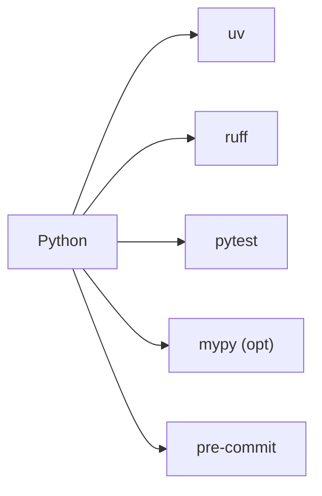
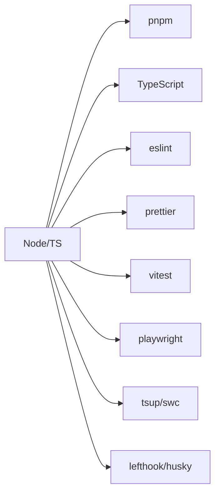
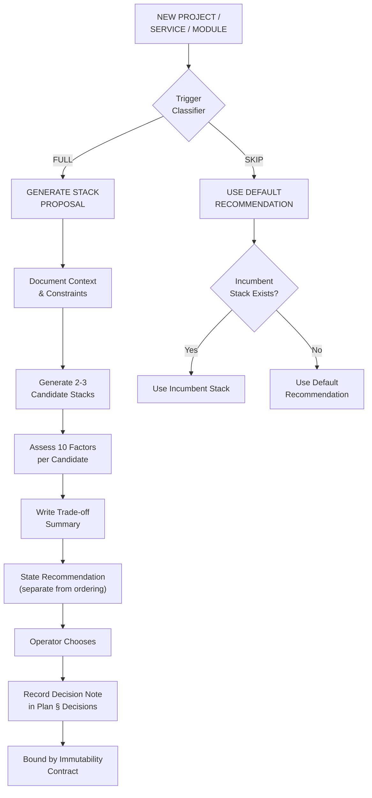

# Technology Guidance & Stack Selection

> **TL;DR:** When creating a new project, service, or module, use the **Default Recommendation** from the table below as your starting point. For non-routine cases (cross-domain, stack-migration, operator-request), generate a **Stack Proposal** with 2-3 candidates with explicit trade-offs and a recommendation. The operator chooses; the choice is recorded as a decision note in the plan and bound by the immutability contract.

## Core Principles

1. Prefer simplicity over complexity.
2. Prefer performance over convenience.
3. Prefer widely adopted tools with strong communities.
4. Do NOT introduce frameworks unless explicitly required.
5. Do NOT over-engineer.
6. Start from the Default Recommendation; generate a proposal when the case is non-routine.
7. Always use the latest stable (LTS where applicable) versions of ALL dependencies. If a latest major has breaking changes — adapt the code, do NOT downgrade.
8. Always include linting, formatting, and testing.
9. Always use Docker for backend services.

## Trigger Classifier — When to Generate a Stack Proposal

Before selecting a stack, classify the task using this table. The classifier produces an explicit output token: `Trigger: FULL` (generate proposal) or `Trigger: SKIP` (use Default Recommendation).

| Signal | Action | Example |
|--------|--------|---------|
| **New project or service scaffold** | FULL — generate proposal | Creating a new microservice, CLI tool, or frontend app |
| **New component whose domain differs from the incumbent stack** | FULL — generate proposal | Adding WebSocket pub/sub to an HTTP-only NestJS service; adding a CLI tool to a web-service project; adding a frontend to a backend-only project |
| **Stack migration** | FULL — generate proposal | Task explicitly names a stack change (Express → Fastify, REST → GraphQL, JS → TS) |
| **Operator explicitly requests** | FULL — generate proposal | Operator asks "compare X vs Y for Z" or "what should we use for..." |
| **Routine work in the same domain** | SKIP — use incumbent or Default Recommendation | Bug fix, minor feature, same-domain CRUD endpoint in an existing service |
| **L1 tasks (any kind)** | SKIP — no proposal for L1 | Quick fixes, single-file changes |

**Default catch-all:** When the classifier cannot unambiguously categorise a task (ambiguous domain boundary, uncertain incumbent fit), default to `Trigger: FULL`. The cost of an unnecessary proposal is lower than the cost of suppressing a legitimate choice.

**Sticky choices:** Once a stack is chosen for a project, subsequent same-project components auto-inherit the choice unless explicitly overridden. Child tasks inherit the parent's stack for the same component automatically. A new proposal fires only when a child introduces a component in a domain the parent did not address.

## Starting Points & Alternatives

Each row shows the **Default Recommendation** (starting point for routine work), **Viable Alternatives** (for proposal generation), and **When to Reconsider** (verifiable litmus tests — if the test passes, generate a proposal).

### Frontend Projects

| Domain | Default Recommendation | Viable Alternatives | When to Reconsider |
|--------|----------------------|--------------------|--------------------|
| **Static Landing** | HTML, CSS, Tailwind CSS, Alpine.js (opt). NO SPA. Docker optional. | Astro (content-heavy), Hugo (Markdown-driven) | More than 3 distinct page templates with shared navigation and blog/news section |
| **Static Multi-Page** | PHP, HTML, Tailwind CSS. SSR templates. NO SPA. Docker required. | Astro + MDX, Eleventy | Content changes more than weekly; non-technical editors need a CMS |
| **Web Frontend (SEO)** | Next.js, React, Tailwind, shadcn/ui, Vite, pnpm, Vitest, Playwright. Docker. | Remix/React Router v7 (simpler mental model, web-standards-first), Astro (content-heavy, zero-JS-by-default) | More than 80% of pages are static content; interactive SPA sections on fewer than 20% of routes; Shopify/Hydrogen storefront |
| **SPA / Dashboard** | Vite, React or Vue, Tailwind, TanStack Query, Vitest. Docker. | MUI + Emotion (enterprise data grids, Material Design acceptable), Mantine (free data table, 60+ hooks, first-class dark mode), shadcn/ui + Radix (full design control, Tailwind-native) | More than 5 distinct table views with sorting, filtering, and inline editing; dark mode is a requirement; dedicated design system needed |

### Backend API Projects

| Domain | Default Recommendation | Viable Alternatives | When to Reconsider |
|--------|----------------------|--------------------|--------------------|
| **Microservice API** | NestJS, Fastify, PostgreSQL, Prisma, Redis, NATS, Docker Compose. | Fastify-plain (higher throughput, less boilerplate), Encore.ts (AI-agent productivity, infra-as-code), Hono (edge-deployable, multi-runtime) | Edge deployment required; team size <3 (NestJS DI overhead); AI writes >30% of backend code |
| **High-Load HTTP API** | Node.js, Fastify, PostgreSQL, Redis, k6. Docker. | Go + stdlib + chi (throughput-critical, lower tail latency), Rust + axum (memory-constrained, CPU-bound) | P99 latency budget <10ms; sustained >50k req/s per instance; GC pause sensitivity |
| **Python API (Modern)** | Python, FastAPI, uvicorn, uv, ruff, pydantic, sqlalchemy, alembic, pytest. Docker. | Litestar (lower overhead, native dependency injection), Django Ninja (Django ecosystem needed) | Django ORM / admin required; real-time WebSocket-heavy (Django Channels) |
| **API Gateway / BFF** | Node.js, Fastify, Zod, OpenAPI. Docker. | Hono (edge-deployable, lower cold-start), Envoy + ext_authz (data-plane proxy) | Deploying to CDN edge (Cloudflare Workers); need request transformation at proxy layer |

> **Ecosystem backend mandate:** `documentation/architecture/backend-stack-standards.md` is the authoritative mandate for Arcanada backend projects. The rows above function as guidance within that constraint — the backend-standards document takes precedence where they differ.

### AI / ML Projects

| Domain | Default Recommendation | Viable Alternatives | When to Reconsider |
|--------|----------------------|--------------------|--------------------|
| **AI / LLM API** | Python, FastAPI, uv, ruff, OpenAI/OpenRouter SDK, Redis. Docker. | Go + OpenAI Go SDK (lower memory, single-binary deploy), TypeScript + Vercel AI SDK (full-stack JS shop) | Multi-model orchestration across >3 providers; streaming aggregation needed |
| **AI Pipelines / RAG** | Python, FastAPI, uv, ruff, LangChain/LlamaIndex, pgvector/Qdrant, Redis. Docker Compose. | Haystack (document-processing pipelines), custom + pgvector (lighter weight, fewer abstractions) | Pipeline has <3 steps (LangChain overhead > value); embedding model is fine-tuned (custom inference path) |
| **Search / Semantic** | Python, FastAPI, uv, ruff, pgvector/Qdrant/Weaviate. Docker Compose. | Meilisearch (full-text-first, simpler ops), Typesense (typo-tolerant, lower memory) | Hybrid search (vector + keyword) is the primary query pattern |

### Real-time Projects

| Domain | Default Recommendation | Viable Alternatives | When to Reconsider |
|--------|----------------------|--------------------|--------------------|
| **Real-Time Chat** | Node.js, Socket.IO or ws, Redis. Docker Compose. | Elixir + Phoenix (high-concurrency, fault-tolerant), Go + gorilla/websocket (lower memory per connection) | >10k concurrent connections per instance; soft-real-time latency budget <50ms |
| **Audio / Video** | Node.js, WebRTC, mediasoup/LiveKit, Redis. Docker Compose. | LiveKit Cloud (managed SFU, no self-host ops), Janus Gateway (C-based, lowest latency) | SFU self-hosting ops cost exceeds managed service cost; sub-50ms latency requirement |
| **WebSockets-Only** | Node.js, ws or uWebSockets.js, Redis Pub/Sub. Docker. | Go + gorilla/websocket + Redis, Elixir + Phoenix Channels | >50k persistent connections; broadcast-to-all pattern dominant |

### Background / Event Projects

| Domain | Default Recommendation | Viable Alternatives | When to Reconsider |
|--------|----------------------|--------------------|--------------------|
| **Background Jobs** | Python, FastAPI, Celery/Dramatiq, Redis/Kafka. Docker Compose. | Go + asynq/temporal.io (type-safe workflows, lower memory), BullMQ + Node.js (JS-native, simpler ops) | Workflow DAG complexity >10 nodes; exactly-once semantics required; multi-hour job durations |
| **Python Workers** | Python, Celery/Dramatiq, Redis/RabbitMQ, uv, ruff. Docker Compose. | Dramatiq (simpler API, lower overhead, no Celery flower dependency), SAQ (async-native, FastAPI integration) | Task rate >1k/s (Celery broker overhead); async-only codebase (no sync workers) |
| **Event-Driven** | NestJS or FastAPI, NATS/Kafka, OpenTelemetry. Docker Compose. | Go + watermill (type-safe, lower memory), Rust + lapin/rdkafka (throughput-critical) | Event throughput >100k msg/s; event replay and long-term retention needed (Kafka over NATS) |

### Media Projects

| Domain | Default Recommendation | Viable Alternatives | When to Reconsider |
|--------|----------------------|--------------------|--------------------|
| **File / Media Processing** | Python, FFmpeg, Celery, S3-compatible storage. Docker Compose. | Go + ffmpeg-go bindings (lower memory, single binary), Rust + ffmpeg-next (CPU-bound transcoding) | Processing >100 files/hour; GPU transcoding pipeline (NVENC/VAAPI) |
| **Streaming Platform** | Node.js, WebRTC, mediasoup, FFmpeg, CDN. Docker Compose. | Go + pion (WebRTC in Go, lower memory), Elixir + Membrane (pipeline-native, fault-tolerant) | Transcoding-per-stream model (not just relay); adaptive bitrate ladder >5 rungs |

### Platform Projects

| Domain | Default Recommendation | Viable Alternatives | When to Reconsider |
|--------|----------------------|--------------------|--------------------|
| **Monorepo** | Nx, TypeScript, pnpm, shared libraries, CI/CD. Docker. | Turborepo (simpler caching model, faster for small repos), Bazel (multi-language, very large repos) | Multi-language repo (Rust + TypeScript + Python); repo exceeds 500 packages |
| **Auth / Identity** | NestJS, Passport, JWT, OAuth2, Redis. Docker. | Ory Stack (Kratos + Hydra, API-first, zero custom auth code), Keycloak (enterprise, self-hosted, SAML/OIDC) | Multi-tenant with >10 OIDC providers; FAPI-compliant (financial-grade) required |
| **Prototyping / MVP** | Next.js, API Routes, PostgreSQL, Prisma. Docker Compose. | Rails (convention-over-configuration, fastest MVP velocity), Encore.ts (infra auto-provisioned, zero DevOps) | Team has zero React/Next.js experience; MVP must become production within 30 days |

### Infrastructure / Backup

| Domain | Default Recommendation | Viable Alternatives | When to Reconsider |
|--------|----------------------|--------------------|--------------------|
| **Server backups** | `restic` + Backblaze B2 (native backend, client-side encryption, dedup, snapshots). Config via `/etc/restic/`, systemd timer for daily backups, `backup-healthcheck.sh` for monitoring. First backup + restore test is mandatory. Use binary-installed restic (apt version lacks `self-update`). | BorgBackup (compression, append-only repos), Kopia (GUI, wider cloud backend support) | Backup size >10 TB (restic prune performance); compliance requires WORM (write-once-read-many) storage |
| **Database backups** | Per-engine tooling (`pg_dump`, `mysqldump`, `mongodump`) piped into restic — captures logical dump as a named file in the repo. | WAL-G (continuous archiving, point-in-time recovery), pgBackRest (parallel, incremental, enterprise PostgreSQL) | Point-in-time recovery required (not just daily snapshots); multi-TB database with <1h RPO |

Source: prior incident reflection — restic + B2 proven across arcana-www/prod/db; standardize to avoid revisiting the choice per-server.

### Cross-Platform CLI / Desktop / Systems

| Domain | Default Recommendation | Viable Alternatives | When to Reconsider |
|--------|----------------------|--------------------|--------------------|
| **Cross-Platform CLI** | Go + Cobra | Rust + clap (compile-time correctness, performance-critical), Zig (ultra-low binary size, C-interop, <2MB target) | Cold-start latency <30ms required; binary size budget <5MB; C library interop needed |
| **Desktop Application** | Tauri (Rust) + React | Go + Fyne (simpler language, smaller bundle, 9.2MB binary), Electron (web-tech team, hot-reload, largest ecosystem) | Platform-specific native look required (Fyne renders own widgets); <20MB bundle hard constraint; need OS-level system tray / global hotkeys |
| **Systems Daemon / Service** | Rust + tokio | Go + standard library (faster development, simpler concurrency), Zig (minimal footprint, ~150KB idle RSS) | GC-pause tolerance unknown; team has zero Rust experience; rapid prototype needed in <1 week |
| **Data / ML Pipeline** | Python + FastAPI + Celery | Go + temporal.io (type-safe workflows, durable execution), Rust + rayon (CPU-bound transforms, zero-GC) | Throughput >10k items/s CPU-bound; GPU orchestration (Python stays king for GPU); exactly-once processing semantics |
| **WASM Module** | Rust + wasm-bindgen | Go (tinygo), Zig | Host runtime is JavaScript-only (Rust toolchain overhead > value); binary size floor <50KB (tinygo or Zig win); needs DOM access (wasm-bindgen + web-sys) |

> **Security guidance coverage for new domains:** The framework's security baseline (S1-S11) provides a general floor, but domain-specific hardening guidance for CLI, Desktop, Systems, Data/ML, and WASM domains is currently minimal. When selecting a non-default stack from these domains, verify security posture manually: run the ecosystem's native audit tool (`cargo audit`, `govulncheck`, `npm audit`), review the sandbox/isolation model, and consult domain-specific hardening references. See `skills/security-baseline/SKILL.md` for the general contract.

## Recommended Toolchains

These are ecosystem-wide quality-floor choices, not per-project architecture decisions. Default to these for their respective language ecosystems.

### Python (Recommended)



- `uv` — dependency & env management
- `ruff` — lint + format (replaces flake8, isort, black)
- `pytest` — testing
- `mypy` — typing (if used)
- `pre-commit hooks`

Prefer `uv` over bare `pip`. Prefer `ruff` over `flake8`/`isort`/`black`. Deviate with a one-line rationale.

### Node / TypeScript (Recommended)



- `pnpm` — package manager
- `TypeScript` — mandatory
- `eslint` + `prettier` — lint + format
- `vitest` — testing
- `playwright` — E2E (frontend)
- `tsup`/`swc` — build
- `lefthook`/`husky` — git hooks

## Architecture Guidance

These rules are guidance, not mandates. Each carries a rationale. Deviate when the rationale does not apply to your project.

1. **No SPA where HTML suffices.** Rationale: SPAs add JS bundle cost, hydration complexity, and SEO friction for content that could be static HTML.
2. **Fastify is the default for Node.js HTTP.** Rationale: schema-based serialization gives ~3-4× Express throughput; Pino logging is built-in. Alternatives: Hono (edge-deployable), Express (largest ecosystem, simplest onboarding).
3. **Redis is the default cache.** Rationale: predictable latency, rich data structures, clustering. Alternative: in-memory LRU for single-instance, non-persistent cache.
4. **Queues ≠ WebSockets.** Use a dedicated queue (BullMQ, Celery, NATS) for work distribution; use WebSockets for real-time client push. Do not abuse WebSocket connections as a job queue.
5. **WebRTC is for media only.** Use WebSockets or HTTP for data; WebRTC adds STUN/TURN/SDP complexity that is only justified for audio/video streams.
6. **Event-driven → NATS or Kafka.** NATS for throughput and simplicity (<10K msg/s, pub/sub, request/reply). Kafka for event replay, long-term retention, and >100K msg/s throughput.
7. **Monorepo → Nx or Turborepo.** Nx for multi-language, large repos. Turborepo for simpler caching, smaller repos.
8. **PHP is for SSR/template reuse only.** Use PHP where server-rendered templates with shared partials are the primary need. Not for APIs or SPAs.
9. **No exotic libraries without justification.** Prefer libraries with ≥1K GitHub stars, active maintenance (commit within 90 days), and a clear security-advisory process. Justify deviations.

## Decision-Making Method

When generating a Stack Proposal, use the method below. Its purpose is to make trade-offs visible and challengeable — not to algorithmically pick a winner.

### ADR-Light Decision Note

Record the operator's choice as a **decision note** in the plan's § Decisions section (not a standalone ADR file). Format:

```markdown
### Decision: Technology Stack for {Component}

**Chosen stack:** {stack description}
**Alternatives considered:** {brief list}
**Rationale:** {1-paragraph synthesis of the key trade-off}
**Escape velocity:** {low/medium/high — how hard to migrate away later}
**Bound by:** immutability contract — revisable via Return-to-Plan amendment
```

### Weighted-Criteria Scoring (Indicative)

Score each candidate 1-5 across the standard factors. Weight by project priorities. The total is indicative — it surfaces anomalies, it does not algorithmically decide.

| Factor | Weight | Candidate 1 | Candidate 2 | Candidate 3 |
|--------|--------|------------|------------|------------|
| Fit for domain | | | | |
| Ecosystem maturity | | | | |
| Team/AI familiarity | | | | |
| Performance profile | | | | |
| Security posture | | | | |
| Licence compatibility | | | | |
| Cost | | | | |
| Bundle/runtime cost | | | | |
| Operational fit (Arcanada) | | | | |
| Escape velocity | | | | |

### Technology-Radar Quadrant (Ecosystem-Level Annotation)

For ecosystem-level posture, annotate each domain row with a radar classification:

- **Adopt** — safe default for new projects in this domain
- **Trial** — use on a non-critical project first; gather evidence
- **Assess** — research-only; do not ship to production yet
- **Hold** — known issues; avoid for new work; plan migration off

The Default Recommendation column carries an implicit "Adopt" classification.

## Stack Proposal Template

When the trigger classifier returns `Trigger: FULL`, generate a proposal using this mandatory shape. The proposal presents candidates and trade-offs; the operator chooses.

```markdown
## Stack Proposal for {Component}

### Context
{1-2 sentences: what is being built, key constraints, domain classification}

### Candidate Stacks

#### Option A: {Stack Name}
| Factor | Assessment |
|--------|-----------|
| Fit for domain | {rationale} |
| Ecosystem maturity | {evidence — version, community size, maintenance cadence} |
| Team/AI familiarity | {assessment — note: agent self-assessment of "familiarity" is non-falsifiable; treat as weak signal} |
| Performance profile | {assessment — cite benchmarks where available} |
| Security posture | {CVE history (past 24 months), sandbox/isolation model, supply-chain trust (signed releases, SLSA attestation), audit-tooling availability, secure-configuration baseline maturity} |
| Licence compatibility | {licence family, copyleft/patent implications, transitive-licence risk} |
| Cost | {monetary cost — free, paid tier, per-seat, usage-based} |
| Bundle/runtime cost | {binary size, cold-start time, memory at idle, Docker image size} |
| Operational fit (Arcanada) | {coherence with existing ecosystem — does Arcanada already run this? shared CLIs, shared infra?} |
| Escape velocity | {low/medium/high — how hard to migrate away; vendor lock-in, skill availability, portability} |

#### Option B: {Alternative Name}
{same structure}

#### Option C: {Alternative Name} (if applicable)
{same structure}

### Trade-off Summary
{1-paragraph synthesis of the key differentiators — what you gain and lose with each option}

### Recommendation
{Agent's recommendation with rationale — stated here, not implied by candidate ordering. Candidates are listed alphabetically or by neutral sort.}

### Operator Decision
- [ ] Option A — {short label}
- [ ] Option B — {short label}
- [ ] Option C — {short label}
- [ ] Other (operator specifies)
```

## Immutability and Binding

A stack choice recorded in the plan's § Decisions is bound by the immutability contract (`skills/immutability/SKILL.md`). It must not be silently swapped mid-implementation.

### Changing the Stack During Implementation

If a concrete constraint makes the chosen stack unsatisfiable (not implementation difficulty — a genuine impossibility: library incompatibility, missing required feature, critical CVE with active exploitation), follow this sequence:

1. **Stop** current `/dr-do` work — do not commit workarounds against the wrong stack.
2. **Record** the concrete reason — one paragraph citing the specific constraint (CVE identifier, missing feature name, incompatibility evidence). Not "this is hard."
3. **Return** to `/dr-plan` or `/dr-prd` with the recorded reason.
4. **Revise** the decision note via the proposal mechanism — generate new candidates that satisfy the discovered constraint.
5. **Operator approves** the revised choice.
6. **Resume** `/dr-do` with the updated decision note.

### Security-Emergency Fast-Track

If a **CVSS 9+ or CISA KEV (Known Exploited Vulnerability)** is published against the chosen stack during implementation, the agent MAY propose and implement an alternative without prior operator approval, provided:

- (a) The CVE identifier and the reason the existing stack is untenable are recorded in the task description decisions section within one turn.
- (b) The stack decision note is amended post-hoc at the next operator review.

This fast-track does NOT apply to medium/low CVEs or to implementation difficulty disguised as a security concern. The normal immutability process applies to all non-security artefacts.

## Scaffold Checklist

After creating a new project in `Projects/*/code/`:
1. `git init` — initialize standalone repo (parent arcanada gitignores `Projects/*/code/`)
2. `pnpm outdated` / `uv pip list --outdated` — zero outdated = pass
3. Verify `.gitignore` covers `node_modules/`, `dist/`, `.env`
4. Initial commit with scaffold

Source: prior incident — Model Connector code had no `.git` for weeks; discovered only at archive time.

## Docker Rules

1. Backend service -> Docker REQUIRED
2. Multiple services -> Docker Compose REQUIRED
3. Local env mirrors production
4. No `latest` tags
5. One container = one responsibility

## Dependency Version Policy

- **General rule:** ALWAYS install the **latest stable** (LTS where applicable) version of every dependency — runtime, toolchain, ORM, framework, CLI tool. If `pnpm add foo` installs a major version with breaking changes, **adapt the code to the new API** instead of downgrading. Downgrading to a previous major is only acceptable if the latest version has a critical, documented, unresolved bug.
- **Node.js:** LTS (even versions), `engines` field, `pnpm-lock.yaml`
- **Python:** latest stable minor, `pyproject.toml`, `uv.lock`
- **Audit after scaffold:** Run `pnpm outdated` (or `uv pip list --outdated`) immediately after project init. Zero outdated packages = pass.
- **AI hallucination guard:** Do NOT rely on training data for current package versions. Before specifying a version in `package.json` / `pyproject.toml`, verify the latest major via `npm view <pkg> version` (or `pip index versions <pkg>`). Prior incident: AI proposed Prisma 6 when Prisma 7 was already the latest stable — caught only at audit, cost rework.
- **Post-install verification (MANDATORY):** After every `pnpm add` / `uv add` during implementation, run `pnpm outdated` (or equivalent). If any dependency shows a newer major, update immediately — do not defer.

## Testing Policy

- Unit tests: **mandatory**
- Integration tests: if DB/queues exist
- E2E tests: for frontend and APIs
- CI fails on missing/failing tests

## When to Apply

This skill is loaded when:
- Creating a new project or service (PRD, plan stages)
- Selecting technology stack during planning (plan stage)
- Evaluating technology choices (research stage)
- Keywords: "stack", "technology", "framework", "new project", "scaffold", "create project"

## Stack Selection Decision Tree



## Reusable Templates

For stack-specific scaffolds (NestJS, Django, Rails, etc.) consult the relevant project's `CLAUDE.md` or its per-project `templates/` directory. The Datarim framework does not ship stack-specific scaffolds — this skill is the designated technology guidance file (whitelisted in `skills/evolution/stack-agnostic-gate.md` per the rationale: names concrete technologies to give actionable recommendations while presenting alternatives and trade-offs rather than single mandated answers).
