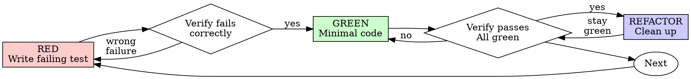

# Test-Driven Development — Discipline Fragment

> Loaded from `skills/testing.md` § Discipline. Apply alongside testing-pyramid and mocking rules from the entry skill.

## Core Principle

Write the test first. Watch it fail. Write minimal code to pass.

**If you didn't watch the test fail, you don't know if it tests the right thing.**

**Violating the letter of the rules is violating the spirit of the rules.**

## When to Use

**Always:**
- New features
- Bug fixes
- Refactoring with behavior change
- Behavior changes

**Exceptions (ask your human partner first):**
- Throwaway prototypes
- Generated code
- Configuration files

Thinking "skip TDD just this once"? Stop. That's rationalization.

## The Iron Law

```
NO PRODUCTION CODE WITHOUT A FAILING TEST FIRST
```

Wrote code before the test? Delete it. Start over.

**No exceptions:**
- Don't keep it as "reference"
- Don't "adapt" it while writing tests
- Don't look at it
- Delete means delete

Implement fresh from tests.

## Red-Green-Refactor



### RED — Write Failing Test

Write one minimal test showing what should happen.

**Requirements:**
- One behavior per test
- Clear, intent-revealing name (no `test1` / `it works`)
- Real code (no mocks unless unavoidable — see entry skill § Mocking Rules)
- The test name describes what the system *should* do, not what the implementation *does*

### Verify RED — Watch It Fail

**MANDATORY. Never skip.**

Run the test. Confirm:
- It fails (does not error)
- The failure message is the one you expected
- It fails because the feature is missing — not because of a typo or stale import

**Test passes?** You're testing existing behavior. Fix the test.

**Test errors?** Fix the error, re-run until it fails *correctly*.

### GREEN — Minimal Code

Write the simplest code that makes the test pass.

Don't add features, don't refactor other code, don't "improve" anything beyond what the test requires. YAGNI.

### Verify GREEN — Watch It Pass

**MANDATORY.**

Run the test (and the rest of the suite). Confirm:
- Target test passes
- Other tests still pass
- Output is pristine (no errors, warnings, deprecation noise)

**Test fails?** Fix the code, not the test.

**Other tests fail?** Fix them now — don't accumulate breakage.

### REFACTOR — Clean Up

Only after green:
- Remove duplication
- Improve names
- Extract helpers
- Tighten interfaces

Keep tests green throughout. Don't add behavior.

### Repeat

Next failing test for next behavior.

## Good Tests

| Quality | Good | Bad |
|---------|------|-----|
| **Minimal** | One thing. "and" in name? Split it. | `test('validates email and domain and whitespace')` |
| **Clear** | Name describes behavior | `test('test1')`, `it('works')` |
| **Shows intent** | Demonstrates desired API | Obscures what code should do |

## Why Order Matters

**"I'll write tests after to verify it works"**

Tests written after code pass immediately. Passing immediately proves nothing:
- Might test the wrong thing
- Might test the implementation, not the behavior
- Might miss edge cases you forgot
- You never saw it catch the bug

Test-first forces you to see the test fail, proving it actually tests something.

**"I already manually tested all the edge cases"**

Manual testing is ad-hoc. You think you tested everything but:
- No record of what you tested
- Can't re-run when code changes
- Easy to forget cases under pressure
- "It worked when I tried it" ≠ comprehensive

Automated tests are systematic. They run the same way every time.

**"Deleting X hours of work is wasteful"**

Sunk cost fallacy. The time is already gone. Your choice now:
- Delete and rewrite with TDD (X more hours, high confidence)
- Keep it and add tests after (30 min, low confidence, likely bugs)

The "waste" is keeping code you can't trust. Working code without real tests is technical debt.

**"TDD is dogmatic, being pragmatic means adapting"**

TDD *is* pragmatic:
- Finds bugs before commit (faster than debugging after)
- Prevents regressions (tests catch breaks immediately)
- Documents behavior (tests show how to use the code)
- Enables refactoring (change freely, tests catch breaks)

"Pragmatic" shortcuts → debugging in production → slower.

**"Tests after achieve the same goals — it's spirit not ritual"**

No. Tests-after answer *"What does this do?"* Tests-first answer *"What should this do?"*

Tests-after are biased by your implementation. You test what you built, not what's required. You verify remembered edge cases, not discovered ones. Tests-first force edge-case discovery before implementing.

## Rationalization Table

| Excuse | Reality |
|--------|---------|
| "Too simple to test" | Simple code breaks. Test takes 30 seconds. |
| "I'll test after" | Tests passing immediately prove nothing. |
| "Tests after achieve same goals" | Tests-after = "what does this do?" Tests-first = "what should this do?" |
| "Already manually tested" | Ad-hoc ≠ systematic. No record, can't re-run. |
| "Deleting X hours is wasteful" | Sunk cost fallacy. Keeping unverified code is technical debt. |
| "Keep as reference, write tests first" | You'll adapt it. That's testing-after. Delete means delete. |
| "Need to explore first" | Fine. Throw away the exploration, then start with TDD. |
| "Test hard = design unclear" | Listen to the test. Hard to test = hard to use. |
| "TDD will slow me down" | TDD is faster than debugging. Pragmatic = test-first. |
| "Manual test faster" | Manual doesn't prove edge cases. You'll re-test every change. |
| "Existing code has no tests" | You're improving it. Add tests for the existing code. |

## Red Flags — STOP and Start Over

- Code before test
- Test after implementation
- Test passes immediately
- Can't explain why test failed
- Tests added "later"
- Rationalizing "just this once"
- "I already manually tested it"
- "Tests after achieve the same purpose"
- "It's about spirit not ritual"
- "Keep as reference" or "adapt existing code"
- "Already spent X hours, deleting is wasteful"
- "TDD is dogmatic, I'm being pragmatic"
- "This is different because..."

**All of these mean: delete code, start over with TDD.**

## Verification Checklist

Before marking work complete:

- [ ] Every new function/method has a test
- [ ] Watched each test fail before implementing
- [ ] Each test failed for the expected reason (feature missing, not typo)
- [ ] Wrote minimal code to pass each test
- [ ] All tests pass
- [ ] Output pristine (no errors, warnings)
- [ ] Tests use real code (mocks only if unavoidable)
- [ ] Edge cases and errors covered

Can't check all boxes? You skipped TDD. Start over.

## When Stuck

| Problem | Solution |
|---------|----------|
| Don't know how to test | Write the wished-for API. Write the assertion first. Ask your human partner. |
| Test too complicated | Design too complicated. Simplify the interface. |
| Must mock everything | Code too coupled. Use dependency injection. |
| Test setup huge | Extract helpers. Still complex? Simplify the design. |

## Debugging Integration

Bug found? Write a failing test that reproduces it. Follow the TDD cycle. The test proves the fix and prevents regression.

Never fix bugs without a test.

## Final Rule

```
Production code → test exists and failed first
Otherwise → not TDD
```

No exceptions without your human partner's permission.
