# Visual Maps — Workflow Diagrams

> **When to load:** When an agent needs orientation in the pipeline, wants to understand routing, or needs to visualize component relationships. Do NOT load for simple tasks where the next step is obvious.

---

## Pipeline Routing by Complexity

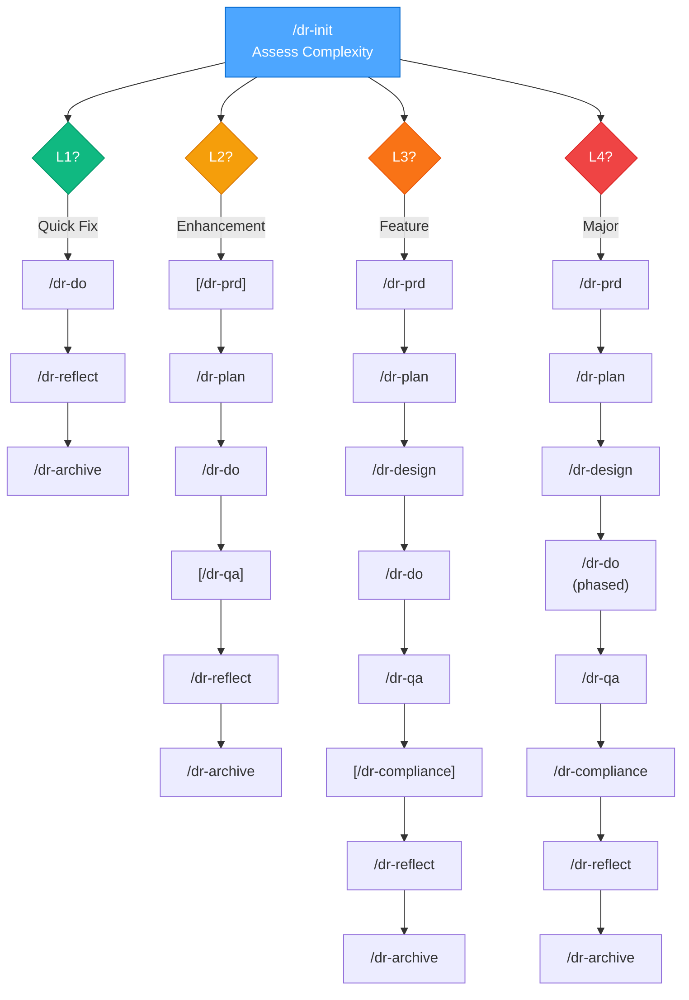

Brackets `[]` = optional at that level.

---

## Stage Process Flows

### /dr-init
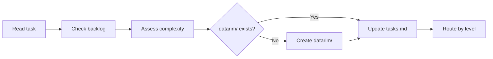

### /dr-prd
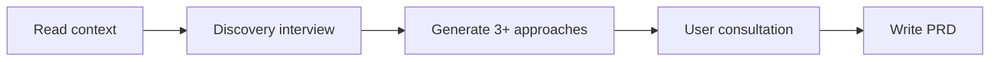

### /dr-plan
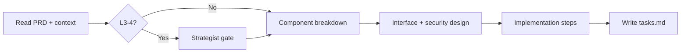

### /dr-design
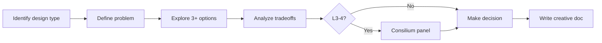

### /dr-do
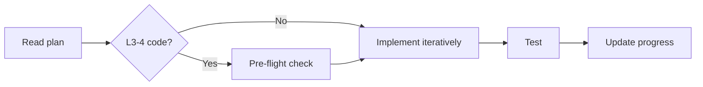

### /dr-qa
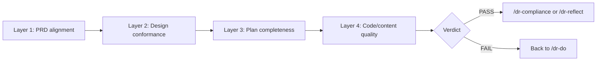

### /dr-compliance
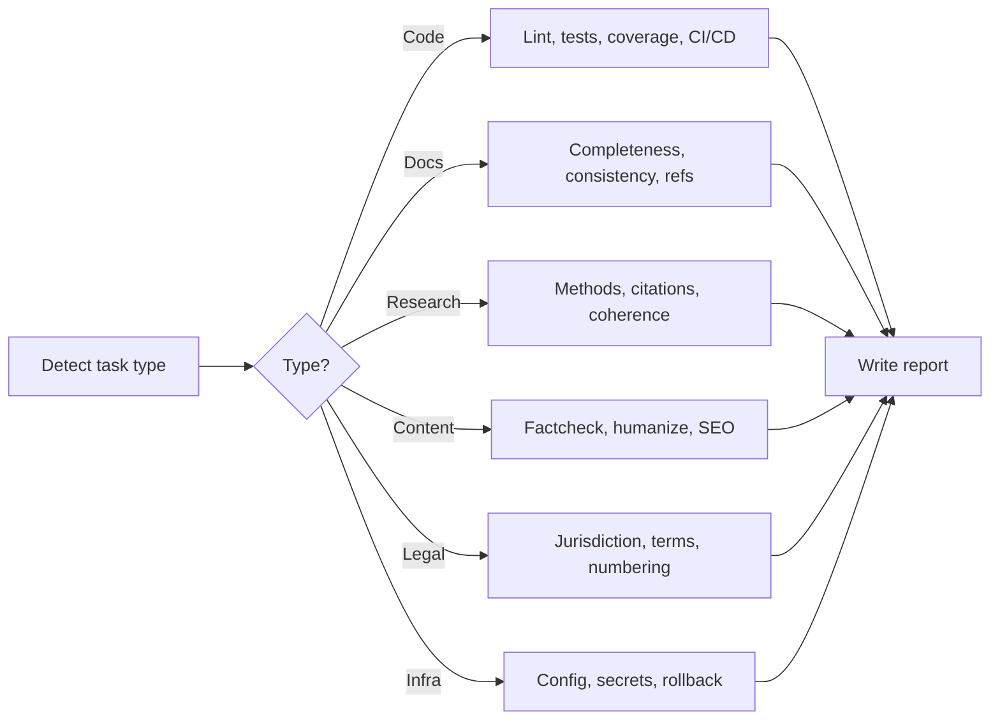

### /dr-reflect
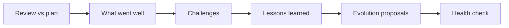

### /dr-archive
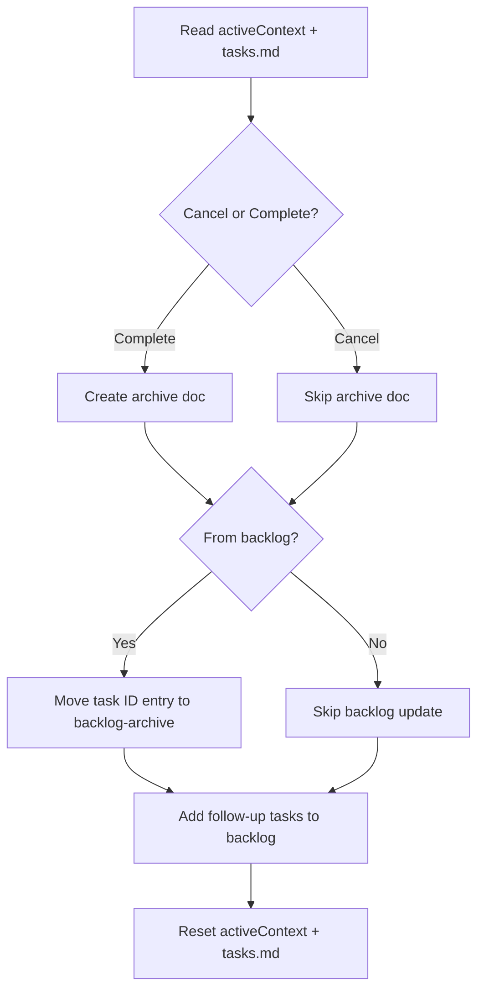

---

## Content Command Flows

### /dr-write
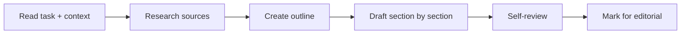

### /dr-edit
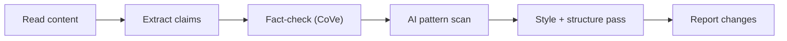

### /factcheck (standalone)
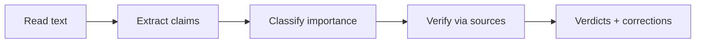

### /humanize (standalone)
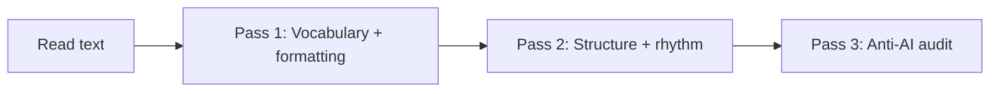

---

## Framework Management Flows

### /dr-addskill
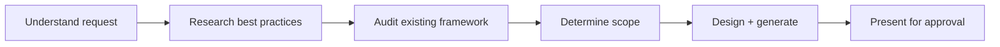

### /dr-optimize
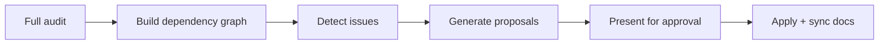

### /dr-dream
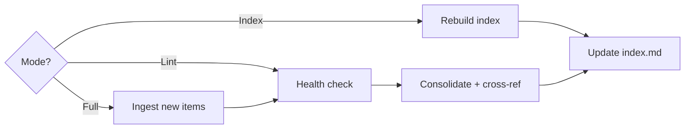

---

## Utility Command Flows

### /dr-status
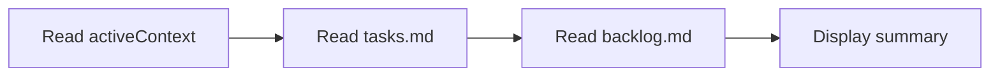

### /dr-continue
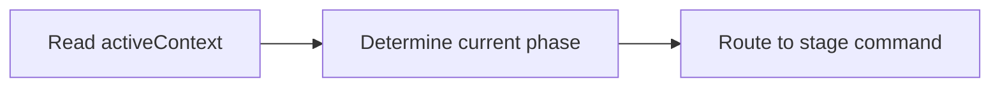

---

## Command — Agent Relationships

```mermaid
graph TD
    subgraph "Pipeline Commands"
        init["/dr-init"]
        prd["/dr-prd"]
        plan["/dr-plan"]
        design["/dr-design"]
        do["/dr-do"]
        qa["/dr-qa"]
        compliance["/dr-compliance"]
        reflect["/dr-reflect"]
        archive["/dr-archive"]
    end

    subgraph "Content Commands"
        write["/dr-write"]
        edit["/dr-edit"]
        factcheck_cmd["/factcheck"]
        humanize_cmd["/humanize"]
    end

    subgraph "Management Commands"
        addskill["/dr-addskill"]
        optimize["/dr-optimize"]
        dream_cmd["/dr-dream"]
    end

    subgraph "Utility Commands"
        status["/dr-status"]
        continue_cmd["/dr-continue"]
        help["/dr-help"]
    end

    subgraph "Agents"
        planner["planner"]
        architect["architect"]
        developer["developer"]
        reviewer["reviewer"]
        comp_agent["compliance"]
        strategist["strategist"]
        writer_agent["writer"]
        editor_agent["editor"]
        skill_creator["skill-creator"]
        optimizer_agent["optimizer"]
        librarian["librarian"]
        security_agent["security"]
        sre_agent["sre"]
        devops_agent["devops"]
        code_simp["code-simplifier"]
    end

    init --> planner
    prd --> architect
    plan --> planner
    plan -.->|"L3-4"| strategist
    design --> architect
    design -.->|"L3-4"| security_agent
    design -.->|"L3-4"| sre_agent
    do --> developer
    do -.-> devops_agent
    qa --> reviewer
    qa -.-> security_agent
    compliance --> comp_agent
    compliance -.-> code_simp
    reflect --> reviewer
    archive --> planner
    write --> writer_agent
    edit --> editor_agent
    factcheck_cmd --> editor_agent
    humanize_cmd --> editor_agent
    addskill --> skill_creator
    optimize --> optimizer_agent
    dream_cmd --> librarian
```

---

## Agent — Skill Dependencies

```mermaid
graph LR
    subgraph "Agents"
        planner["planner"]
        architect["architect"]
        developer["developer"]
        reviewer["reviewer"]
        comp_agent["compliance"]
        writer_agent["writer"]
        editor_agent["editor"]
        skill_creator["skill-creator"]
        optimizer_agent["optimizer"]
        librarian["librarian"]
        strategist["strategist"]
        devops_agent["devops"]
        sre_agent["sre"]
        security_agent["security"]
    end

    subgraph "Skills"
        sys["datarim-system"]
        aiq["ai-quality"]
        sec["security"]
        test["testing"]
        perf["performance"]
        tech["tech-stack"]
        cons["consilium"]
        disc["discovery"]
        evo["evolution"]
        writ["writing"]
        drm["dream"]
        comp_sk["compliance"]
        fc["factcheck"]
        hum["humanize"]
        seo["seo-launch"]
        mkt["marketing"]
        util["utilities"]
        vmap["visual-maps"]
    end

    planner --> sys & aiq & tech
    architect --> sys & tech & perf & sec & cons
    developer --> sys & aiq & test
    reviewer --> sys & sec & test
    comp_agent --> sys & comp_sk
    writer_agent --> sys & writ & fc
    editor_agent --> sys & fc & hum & writ
    skill_creator --> sys & evo & writ
    optimizer_agent --> sys & evo
    librarian --> sys & drm
    strategist --> sys
    devops_agent --> sys & tech & sec
    sre_agent --> sys & perf & sec
    security_agent --> sys & sec & comp_sk
```

---

## Consilium Panel Compositions

```mermaid
graph TD
    subgraph "Architecture Panel"
        A1["architect"] --- A2["developer"]
        A2 --- A3["security"]
        A3 --- A4["sre"]
    end

    subgraph "Code Design Panel"
        C1["architect"] --- C2["developer"]
        C2 --- C3["reviewer"]
    end

    subgraph "Production Readiness"
        P1["sre"] --- P2["security"]
        P2 --- P3["devops"]
        P3 --- P4["reviewer"]
    end

    subgraph "Content Panel"
        W1["writer"] --- W2["editor"]
    end

    subgraph "Knowledge Panel"
        K1["librarian"] --- K2["architect"]
    end
```

---

## Quality Rules by Stage

See `ai-quality.md` § Stage-Rule Mapping for which of the 15 rules apply at each pipeline stage.

| Stage | Key Rules | Focus |
|-------|-----------|-------|
| /dr-plan | #1, #5, #6, #7, #11 | Decomposition, scope, boundaries |
| /dr-design | #6, #7, #9, #13 | Design quality, cognitive load |
| /dr-do | #2, #3, #8, #9 | TDD, method size, iteration |
| /dr-qa | #5, #10 | DoD verification, focused review |
| /dr-reflect | #8, #10 | Process verification |
