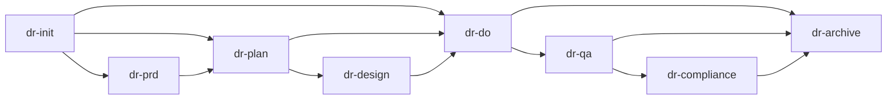

# Command Dependency Graph

> **Derived artefact — keep in sync with `dev-tools/command-graph.yaml`.**
> When the YAML source of truth changes (commands added, edges updated),
> update this Mermaid diagram to match. The YAML is the authoritative
> machine-readable form; this file is the human-readable / renderable view.

## Pipeline Flow (core stages)

## Optional at Complexity Levels

| Command | Optional at |
|---------|------------|
| `dr-prd` | L1, L2 |
| `dr-plan` | L1 |
| `dr-design` | L1, L2 |
| `dr-qa` | L1, L2 |
| `dr-compliance` | L1, L2 |
| `dr-edit` | L1 |

## Entry-Point Commands (no prerequisites)

These commands may be invoked at any time without a prior pipeline stage:

| Command | Stage | Description |
|---------|-------|-------------|
| `dr-help` | utility | List all commands with descriptions |
| `dr-status` | utility | Check current task and backlog |
| `dr-doctor` | maintenance | Diagnose and repair operational files |
| `dr-auto` | meta | Autonomous pipeline execution |
| `dr-addskill` | extension | Create or update skills/agents/commands |
| `dr-dream` | maintenance | Knowledge base maintenance |
| `dr-optimize` | maintenance | Framework audit and pruning |
| `dr-plugin` | extension | Manage plugin system |
| `dr-orchestrate` | plugin | Self-driving pipeline runner (plugin) |
| `dr-verify` | quality | Standalone tri-layer verification |

## Content Pipeline

## Full Command Inventory (24 commands)

Generated from `dev-tools/command-graph.yaml` § commands — 24 entries total.

| Command | Stage | Requires |
|---------|-------|---------|
| `dr-init` | init | — |
| `dr-prd` | requirements | dr-init |
| `dr-plan` | planning | dr-init |
| `dr-design` | design | dr-plan |
| `dr-do` | execution | dr-plan |
| `dr-qa` | quality | dr-do |
| `dr-compliance` | hardening | dr-qa |
| `dr-archive` | archive | dr-do |
| `dr-verify` | quality | dr-do |
| `dr-status` | utility | — |
| `dr-next` | utility | dr-init |
| `dr-help` | utility | — |
| `dr-doctor` | maintenance | — |
| `dr-auto` | meta | — |
| `dr-quick` | meta | dr-init |
| `dr-write` | content | dr-init |
| `dr-edit` | content | dr-write |
| `dr-publish` | content | dr-write |
| `dr-addskill` | extension | — |
| `dr-dream` | maintenance | — |
| `dr-optimize` | maintenance | — |
| `dr-plugin` | extension | — |
| `dr-orchestrate` | plugin | — |
| `factcheck` | standalone | — |
