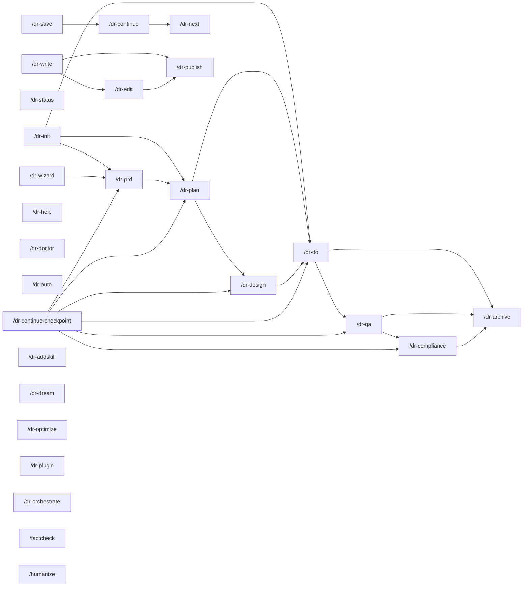

# Command Dependencies — Generated Map

> **GENERATED FILE. DO NOT EDIT.** Source: `dev-tools/command-graph.yaml`. Regenerate with `python3 dev-tools/framework-graph.py --write`.

Full Command Inventory (29 commands)

```mermaid
graph LR
    dr-init["/dr-init"] --> dr-prd["/dr-prd"]
    dr-init["/dr-init"] --> dr-plan["/dr-plan"]
    dr-init["/dr-init"] --> dr-do["/dr-do"]
    dr-prd["/dr-prd"] --> dr-plan["/dr-plan"]
    dr-wizard["/dr-wizard"] --> dr-prd["/dr-prd"]
    dr-plan["/dr-plan"] --> dr-design["/dr-design"]
    dr-plan["/dr-plan"] --> dr-do["/dr-do"]
    dr-design["/dr-design"] --> dr-do["/dr-do"]
    dr-do["/dr-do"] --> dr-qa["/dr-qa"]
    dr-do["/dr-do"] --> dr-archive["/dr-archive"]
    dr-qa["/dr-qa"] --> dr-compliance["/dr-compliance"]
    dr-qa["/dr-qa"] --> dr-archive["/dr-archive"]
    dr-compliance["/dr-compliance"] --> dr-archive["/dr-archive"]
    dr-status["/dr-status"]
    dr-save["/dr-save"] --> dr-continue["/dr-continue"]
    dr-continue["/dr-continue"] --> dr-next["/dr-next"]
    dr-continue-checkpoint["/dr-continue-checkpoint"] --> dr-prd["/dr-prd"]
    dr-continue-checkpoint["/dr-continue-checkpoint"] --> dr-design["/dr-design"]
    dr-continue-checkpoint["/dr-continue-checkpoint"] --> dr-plan["/dr-plan"]
    dr-continue-checkpoint["/dr-continue-checkpoint"] --> dr-do["/dr-do"]
    dr-continue-checkpoint["/dr-continue-checkpoint"] --> dr-qa["/dr-qa"]
    dr-continue-checkpoint["/dr-continue-checkpoint"] --> dr-compliance["/dr-compliance"]
    dr-help["/dr-help"]
    dr-doctor["/dr-doctor"]
    dr-auto["/dr-auto"]
    dr-write["/dr-write"] --> dr-edit["/dr-edit"]
    dr-write["/dr-write"] --> dr-publish["/dr-publish"]
    dr-edit["/dr-edit"] --> dr-publish["/dr-publish"]
    dr-addskill["/dr-addskill"]
    dr-dream["/dr-dream"]
    dr-optimize["/dr-optimize"]
    dr-plugin["/dr-plugin"]
    dr-orchestrate["/dr-orchestrate"]
    factcheck["/factcheck"]
    humanize["/humanize"]
```

## Inventory

- `/dr-init` — stage `init`
- `/dr-prd` — stage `requirements`
- `/dr-wizard` — stage `requirements` · entry point
- `/dr-plan` — stage `planning`
- `/dr-design` — stage `design`
- `/dr-do` — stage `execution`
- `/dr-qa` — stage `quality`
- `/dr-compliance` — stage `hardening`
- `/dr-archive` — stage `archive`
- `/dr-verify` — stage `quality` · entry point
- `/dr-status` — stage `utility` · entry point
- `/dr-next` — stage `utility` · entry point
- `/dr-save` — stage `utility` · entry point
- `/dr-continue` — stage `utility` · entry point
- `/dr-continue-checkpoint` — stage `utility` · entry point
- `/dr-help` — stage `utility` · entry point
- `/dr-doctor` — stage `maintenance` · entry point
- `/dr-auto` — stage `meta` · entry point
- `/dr-quick` — stage `meta` · entry point
- `/dr-write` — stage `content`
- `/dr-edit` — stage `content`
- `/dr-publish` — stage `content`
- `/dr-addskill` — stage `extension` · entry point
- `/dr-dream` — stage `maintenance` · entry point
- `/dr-optimize` — stage `maintenance` · entry point
- `/dr-plugin` — stage `extension` · entry point
- `/dr-orchestrate` — stage `plugin` · entry point
- `/factcheck` — stage `standalone` · entry point
- `/humanize` — stage `standalone` · entry point
