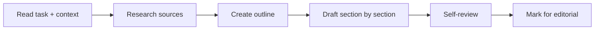
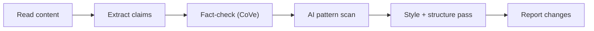
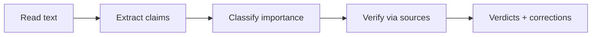
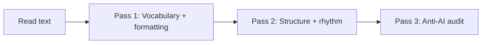
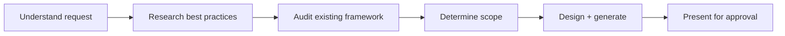
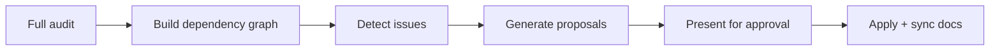
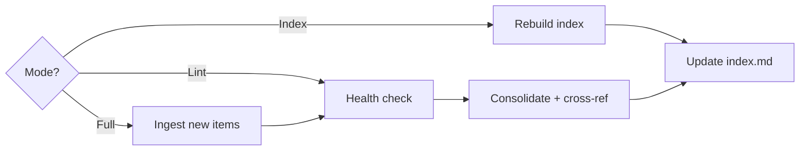

# Visual Maps — Content and Management Flows

## Content Command Flows

### /dr-write

### /dr-edit

### /factcheck

### /humanize

## Framework Management Flows

### /dr-addskill

### /dr-optimize

### /dr-dream

