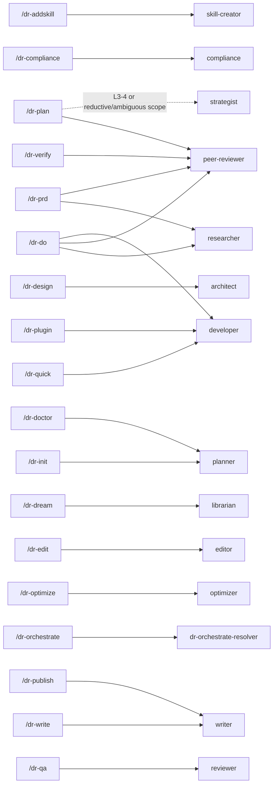

# Framework Architecture — Generated Map

> **GENERATED FILE. DO NOT EDIT.** Source: repository inventory + `dev-tools/command-graph.yaml` + explicit references in commands/agents. Regenerate with `python3 dev-tools/framework-graph.py --write`.

Inventory: **28 commands · 19 agents · 79 skills**.

## Command → Agent graph

## Agent → Skill graph

```mermaid
graph LR
    A_architect["architect"] --> S_cta_format["cta-format"]
    A_architect["architect"] --> S_datarim_system["datarim-system"]
    A_architect["architect"] --> S_immutability["immutability"]
    A_architect["architect"] --> S_performance["performance"]
    A_architect["architect"] --> S_security["security"]
    A_architect["architect"] --> S_tech_stack["tech-stack"]
    A_compliance["compliance"] --> S_compliance["compliance"]
    A_compliance["compliance"] --> S_cta_format["cta-format"]
    A_developer["developer"] --> S_ai_quality["ai-quality"]
    A_developer["developer"] --> S_cta_format["cta-format"]
    A_developer["developer"] --> S_datarim_system["datarim-system"]
    A_developer["developer"] --> S_testing["testing"]
    A_devops["devops"] --> S_datarim_system["datarim-system"]
    A_devops["devops"] --> S_infra_automation["infra-automation"]
    A_devops["devops"] --> S_security["security"]
    A_devops["devops"] --> S_tech_stack["tech-stack"]
    A_editor["editor"] --> S_datarim_system["datarim-system"]
    A_editor["editor"] --> S_factcheck["factcheck"]
    A_editor["editor"] --> S_humanize["humanize"]
    A_editor["editor"] --> S_image_prompting["image-prompting"]
    A_librarian["librarian"] --> S_datarim_system["datarim-system"]
    A_librarian["librarian"] --> S_dream["dream"]
    A_optimizer["optimizer"] --> S_datarim_system["datarim-system"]
    A_optimizer["optimizer"] --> S_evolution["evolution"]
    A_peer_reviewer["peer-reviewer"] --> S_self_verification["self-verification"]
    A_planner["planner"] --> S_ai_quality["ai-quality"]
    A_planner["planner"] --> S_cta_format["cta-format"]
    A_planner["planner"] --> S_datarim_system["datarim-system"]
    A_planner["planner"] --> S_tech_stack["tech-stack"]
    A_researcher["researcher"] --> S_datarim_system["datarim-system"]
    A_researcher["researcher"] --> S_research_workflow["research-workflow"]
    A_researcher["researcher"] --> S_tech_stack["tech-stack"]
    A_reviewer["reviewer"] --> S_cta_format["cta-format"]
    A_reviewer["reviewer"] --> S_datarim_system["datarim-system"]
    A_reviewer["reviewer"] --> S_security["security"]
    A_reviewer["reviewer"] --> S_testing["testing"]
    A_security["security"] --> S_compliance["compliance"]
    A_security["security"] --> S_datarim_system["datarim-system"]
    A_security["security"] --> S_security["security"]
    A_skill_creator["skill-creator"] --> S_datarim_system["datarim-system"]
    A_skill_creator["skill-creator"] --> S_evolution["evolution"]
    A_skill_creator["skill-creator"] --> S_writing["writing"]
    A_sre["sre"] --> S_datarim_system["datarim-system"]
    A_sre["sre"] --> S_infra_automation["infra-automation"]
    A_sre["sre"] --> S_performance["performance"]
    A_sre["sre"] --> S_security["security"]
    A_strategist["strategist"] --> S_datarim_system["datarim-system"]
    A_tester["tester"] --> S_datarim_system["datarim-system"]
    A_tester["tester"] --> S_frontend_ui["frontend-ui"]
    A_tester["tester"] --> S_testing["testing"]
    A_writer["writer"] --> S_datarim_system["datarim-system"]
    A_writer["writer"] --> S_factcheck["factcheck"]
    A_writer["writer"] --> S_humanize["humanize"]
    A_writer["writer"] --> S_image_prompting["image-prompting"]
    A_writer["writer"] --> S_publishing["publishing"]
```

## Complete inventory

### Commands

`/dr-addskill`, `/dr-archive`, `/dr-auto`, `/dr-compliance`, `/dr-continue`, `/dr-design`, `/dr-do`, `/dr-doctor`, `/dr-dream`, `/dr-edit`, `/dr-help`, `/dr-init`, `/dr-next`, `/dr-optimize`, `/dr-orchestrate`, `/dr-plan`, `/dr-plugin`, `/dr-prd`, `/dr-publish`, `/dr-qa`, `/dr-quick`, `/dr-save`, `/dr-status`, `/dr-verify`, `/dr-wizard`, `/dr-write`, `/factcheck`, `/humanize`

### Agents

`architect`, `code-simplifier`, `compliance`, `developer`, `devops`, `dr-orchestrate-resolver`, `editor`, `librarian`, `optimizer`, `peer-reviewer`, `planner`, `researcher`, `reviewer`, `security`, `skill-creator`, `sre`, `strategist`, `tester`, `writer`

### Skills

`adversarial-review`, `ai-quality`, `artifact-context`, `autonomous-mode`, `brainstorming`, `code-contracts`, `compliance`, `consilium`, `context-window-self-clearing`, `cron-agent-patterns`, `cta-format`, `customer-delivery`, `datarim-doctor`, `datarim-system`, `diataxis-docs`, `discovery`, `dispatching-parallel-agents`, `dr-init-id-collision-window`, `dr-next-snapshot-replay`, `dream`, `edge-case-hunter`, `evolution`, `executing-plans`, `expectations-checklist`, `factcheck`, `file-sync-config`, `finishing-a-development-branch`, `fleet`, `fleet/l1-basic`, `fleet/l2-structured`, `fleet/l3-analyst`, `fleet/l4-expert`, `fleet/l5-autonomous`, `frontend-ui`, `health-controller-stub-detector`, `human-summary`, `humanize`, `image-prompting`, `immutability`, `infra-automation`, `init-task-persistence`, `network-exposure-baseline`, `nginx-version-compat`, `performance`, `plan-path-validator`, `playwright-qa`, `post-deploy-env-diff`, `prod-readiness-probe`, `project-init`, `publishing`, `receiving-code-review`, `reflecting`, `release-verify`, `requesting-code-review`, `research-workflow`, `rotation-runbook`, `seam-vs-integration-boundary`, `security`, `security-baseline`, `self-verification`, `session-handoff-replay`, `session-handoff-writer`, `stage-snapshot-writer`, `structure-review`, `structured-outputs-integration-gate`, `subagent-driven-development`, `systematic-debugging`, `tech-stack`, `test-env-verification`, `testing`, `using-git-worktrees`, `utilities`, `v-ac-axis-split`, `v-ac-feasibility`, `verification-before-completion`, `visual-maps`, `wizard`, `writing`, `writing-plans`
