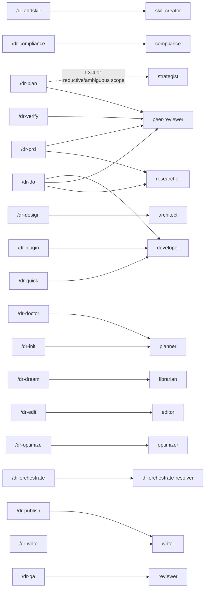

# Framework Architecture — Generated Map

> **GENERATED FILE. DO NOT EDIT.** Source: repository inventory + `dev-tools/command-graph.yaml` + explicit references in commands/agents. Regenerate with `python3 dev-tools/framework-graph.py --write`.

Inventory: **29 commands · 19 agents · 80 skills · 43 template assets**.

## Command → Agent graph

```mermaid
graph LR
    C_dr_plan["/dr-plan"] -.->|"L3-4 or reductive/ambiguous scope"| A_strategist["strategist"]
    C_dr_addskill["/dr-addskill"] --> A_skill_creator["skill-creator"]
    C_dr_compliance["/dr-compliance"] --> A_compliance["compliance"]
    C_dr_design["/dr-design"] --> A_architect["architect"]
    C_dr_do["/dr-do"] --> A_developer["developer"]
    C_dr_do["/dr-do"] --> A_peer_reviewer["peer-reviewer"]
    C_dr_do["/dr-do"] --> A_researcher["researcher"]
    C_dr_doctor["/dr-doctor"] --> A_planner["planner"]
    C_dr_dream["/dr-dream"] --> A_librarian["librarian"]
    C_dr_edit["/dr-edit"] --> A_editor["editor"]
    C_dr_init["/dr-init"] --> A_planner["planner"]
    C_dr_optimize["/dr-optimize"] --> A_optimizer["optimizer"]
    C_dr_orchestrate["/dr-orchestrate"] --> A_dr_orchestrate_resolver["dr-orchestrate-resolver"]
    C_dr_plan["/dr-plan"] --> A_peer_reviewer["peer-reviewer"]
    C_dr_plugin["/dr-plugin"] --> A_developer["developer"]
    C_dr_prd["/dr-prd"] --> A_peer_reviewer["peer-reviewer"]
    C_dr_prd["/dr-prd"] --> A_researcher["researcher"]
    C_dr_publish["/dr-publish"] --> A_writer["writer"]
    C_dr_qa["/dr-qa"] --> A_reviewer["reviewer"]
    C_dr_quick["/dr-quick"] --> A_developer["developer"]
    C_dr_verify["/dr-verify"] --> A_peer_reviewer["peer-reviewer"]
    C_dr_write["/dr-write"] --> A_writer["writer"]
```

## Agent → Skill graph

```mermaid
graph LR
    A_architect["architect"] --> S_human_outcome_reporting["human-outcome-reporting"]
    A_architect["architect"] --> S_cta_format["cta-format"]
    A_architect["architect"] --> S_datarim_system["datarim-system"]
    A_architect["architect"] --> S_immutability["immutability"]
    A_architect["architect"] --> S_performance["performance"]
    A_architect["architect"] --> S_security["security"]
    A_architect["architect"] --> S_tech_stack["tech-stack"]
    A_code_simplifier["code-simplifier"] --> S_human_outcome_reporting["human-outcome-reporting"]
    A_code_simplifier["code-simplifier"] --> S_security["security"]
    A_compliance["compliance"] --> S_human_outcome_reporting["human-outcome-reporting"]
    A_compliance["compliance"] --> S_compliance["compliance"]
    A_compliance["compliance"] --> S_cta_format["cta-format"]
    A_compliance["compliance"] --> S_immutability["immutability"]
    A_compliance["compliance"] --> S_security["security"]
    A_developer["developer"] --> S_human_outcome_reporting["human-outcome-reporting"]
    A_developer["developer"] --> S_ai_quality["ai-quality"]
    A_developer["developer"] --> S_cta_format["cta-format"]
    A_developer["developer"] --> S_datarim_system["datarim-system"]
    A_developer["developer"] --> S_immutability["immutability"]
    A_developer["developer"] --> S_security["security"]
    A_developer["developer"] --> S_testing["testing"]
    A_devops["devops"] --> S_human_outcome_reporting["human-outcome-reporting"]
    A_devops["devops"] --> S_datarim_system["datarim-system"]
    A_devops["devops"] --> S_infra_automation["infra-automation"]
    A_devops["devops"] --> S_security["security"]
    A_devops["devops"] --> S_tech_stack["tech-stack"]
    A_devops["devops"] --> S_testing["testing"]
    A_dr_orchestrate_resolver["dr-orchestrate-resolver"] --> S_human_outcome_reporting["human-outcome-reporting"]
    A_editor["editor"] --> S_human_outcome_reporting["human-outcome-reporting"]
    A_editor["editor"] --> S_datarim_system["datarim-system"]
    A_editor["editor"] --> S_factcheck["factcheck"]
    A_editor["editor"] --> S_humanize["humanize"]
    A_editor["editor"] --> S_image_prompting["image-prompting"]
    A_editor["editor"] --> S_immutability["immutability"]
    A_librarian["librarian"] --> S_human_outcome_reporting["human-outcome-reporting"]
    A_librarian["librarian"] --> S_datarim_system["datarim-system"]
    A_librarian["librarian"] --> S_dream["dream"]
    A_optimizer["optimizer"] --> S_human_outcome_reporting["human-outcome-reporting"]
    A_optimizer["optimizer"] --> S_datarim_system["datarim-system"]
    A_optimizer["optimizer"] --> S_evolution["evolution"]
    A_peer_reviewer["peer-reviewer"] --> S_human_outcome_reporting["human-outcome-reporting"]
    A_peer_reviewer["peer-reviewer"] --> S_security["security"]
    A_peer_reviewer["peer-reviewer"] --> S_self_verification["self-verification"]
    A_planner["planner"] --> S_human_outcome_reporting["human-outcome-reporting"]
    A_planner["planner"] --> S_ai_quality["ai-quality"]
    A_planner["planner"] --> S_cta_format["cta-format"]
    A_planner["planner"] --> S_datarim_system["datarim-system"]
    A_planner["planner"] --> S_immutability["immutability"]
    A_planner["planner"] --> S_tech_stack["tech-stack"]
    A_researcher["researcher"] --> S_human_outcome_reporting["human-outcome-reporting"]
    A_researcher["researcher"] --> S_datarim_system["datarim-system"]
    A_researcher["researcher"] --> S_research_workflow["research-workflow"]
    A_researcher["researcher"] --> S_security["security"]
    A_researcher["researcher"] --> S_tech_stack["tech-stack"]
    A_reviewer["reviewer"] --> S_human_outcome_reporting["human-outcome-reporting"]
    A_reviewer["reviewer"] --> S_cta_format["cta-format"]
    A_reviewer["reviewer"] --> S_datarim_system["datarim-system"]
    A_reviewer["reviewer"] --> S_immutability["immutability"]
    A_reviewer["reviewer"] --> S_security["security"]
    A_reviewer["reviewer"] --> S_testing["testing"]
    A_security["security"] --> S_human_outcome_reporting["human-outcome-reporting"]
    A_security["security"] --> S_compliance["compliance"]
    A_security["security"] --> S_datarim_system["datarim-system"]
    A_security["security"] --> S_security["security"]
    A_skill_creator["skill-creator"] --> S_human_outcome_reporting["human-outcome-reporting"]
    A_skill_creator["skill-creator"] --> S_datarim_system["datarim-system"]
    A_skill_creator["skill-creator"] --> S_evolution["evolution"]
    A_skill_creator["skill-creator"] --> S_writing["writing"]
    A_sre["sre"] --> S_human_outcome_reporting["human-outcome-reporting"]
    A_sre["sre"] --> S_datarim_system["datarim-system"]
    A_sre["sre"] --> S_infra_automation["infra-automation"]
    A_sre["sre"] --> S_performance["performance"]
    A_sre["sre"] --> S_security["security"]
    A_strategist["strategist"] --> S_human_outcome_reporting["human-outcome-reporting"]
    A_strategist["strategist"] --> S_datarim_system["datarim-system"]
    A_tester["tester"] --> S_human_outcome_reporting["human-outcome-reporting"]
    A_tester["tester"] --> S_datarim_system["datarim-system"]
    A_tester["tester"] --> S_frontend_ui["frontend-ui"]
    A_tester["tester"] --> S_immutability["immutability"]
    A_tester["tester"] --> S_security["security"]
    A_tester["tester"] --> S_testing["testing"]
    A_writer["writer"] --> S_human_outcome_reporting["human-outcome-reporting"]
    A_writer["writer"] --> S_datarim_system["datarim-system"]
    A_writer["writer"] --> S_factcheck["factcheck"]
    A_writer["writer"] --> S_humanize["humanize"]
    A_writer["writer"] --> S_image_prompting["image-prompting"]
    A_writer["writer"] --> S_immutability["immutability"]
    A_writer["writer"] --> S_publishing["publishing"]
```

## Complete inventory

### Commands

`/dr-addskill`, `/dr-archive`, `/dr-auto`, `/dr-compliance`, `/dr-continue`, `/dr-design`, `/dr-do`, `/dr-doctor`, `/dr-dream`, `/dr-edit`, `/dr-explain`, `/dr-help`, `/dr-init`, `/dr-next`, `/dr-optimize`, `/dr-orchestrate`, `/dr-plan`, `/dr-plugin`, `/dr-prd`, `/dr-publish`, `/dr-qa`, `/dr-quick`, `/dr-save`, `/dr-status`, `/dr-verify`, `/dr-wizard`, `/dr-write`, `/factcheck`, `/humanize`

### Agents

`architect`, `code-simplifier`, `compliance`, `developer`, `devops`, `dr-orchestrate-resolver`, `editor`, `librarian`, `optimizer`, `peer-reviewer`, `planner`, `researcher`, `reviewer`, `security`, `skill-creator`, `sre`, `strategist`, `tester`, `writer`

### Skills

`adversarial-review`, `ai-quality`, `artifact-context`, `autonomous-mode`, `brainstorming`, `code-contracts`, `compliance`, `consilium`, `context-window-self-clearing`, `cron-agent-patterns`, `cta-format`, `customer-delivery`, `datarim-doctor`, `datarim-system`, `diataxis-docs`, `discovery`, `dispatching-parallel-agents`, `dr-init-id-collision-window`, `dr-next-snapshot-replay`, `dream`, `edge-case-hunter`, `evolution`, `executing-plans`, `expectations-checklist`, `factcheck`, `file-sync-config`, `finishing-a-development-branch`, `fleet`, `fleet/l1-basic`, `fleet/l2-structured`, `fleet/l3-analyst`, `fleet/l4-expert`, `fleet/l5-autonomous`, `frontend-ui`, `health-controller-stub-detector`, `human-outcome-reporting`, `human-summary`, `humanize`, `image-prompting`, `immutability`, `infra-automation`, `init-task-persistence`, `network-exposure-baseline`, `nginx-version-compat`, `performance`, `plan-path-validator`, `playwright-qa`, `post-deploy-env-diff`, `prod-readiness-probe`, `project-init`, `publishing`, `receiving-code-review`, `reflecting`, `release-verify`, `requesting-code-review`, `research-workflow`, `rotation-runbook`, `seam-vs-integration-boundary`, `security`, `security-baseline`, `self-verification`, `session-handoff-replay`, `session-handoff-writer`, `stage-snapshot-writer`, `structure-review`, `structured-outputs-integration-gate`, `subagent-driven-development`, `systematic-debugging`, `tech-stack`, `test-env-verification`, `testing`, `using-git-worktrees`, `utilities`, `v-ac-axis-split`, `v-ac-feasibility`, `verification-before-completion`, `visual-maps`, `wizard`, `writing`, `writing-plans`

## Template dependencies

| Consumer | Template |
|----------|----------|
| `agent:researcher` | `insights-template.md` |
| `command:dr-archive` | `archive-template.md` |
| `command:dr-compliance` | `compliance-report-template.md` |
| `command:dr-init` | `backlog-template.md` |
| `command:dr-init` | `expectations-template.md` |
| `command:dr-init` | `task-template.md` |
| `command:dr-plan` | `infra-cost-reduction-checklist.md` |
| `command:dr-plan` | `integration-checklist.md` |
| `command:dr-plan` | `security-deps-upgrade-plan.md` |
| `command:dr-plugin` | `enabled-plugins.md.template` |
| `command:dr-plugin` | `plugin.yaml.template` |
| `command:dr-prd` | `insights-template.md` |
| `command:dr-prd` | `prd-template.md` |
| `command:dr-quick` | `task-template.md` |
| `fragment:skills/datarim-system/command-and-archive-rules.md` | `project-agents-md.md` |
| `fragment:skills/datarim-system/command-and-archive-rules.md` | `project-docs-stubs.md` |
| `fragment:skills/datarim-system/task-identity-and-context.md` | `activeContext-template.md` |
| `fragment:skills/evolution/stack-agnostic-gate.md` | `docker-smoke-checklist.md` |
| `fragment:skills/human-outcome-reporting/references/datarim.md` | `human-outcome-report-template.md` |
| `fragment:skills/utilities/shell-conventions.md` | `shell-helper-template.sh` |
| `skill:compliance` | `compliance-report-template.md` |
| `skill:compliance` | `coverage-deferral-clause.md` |
| `skill:cta-format` | `cta-template.md` |
| `skill:file-sync-config` | `cli-conflict-resolver-prompt.md` |
| `skill:human-summary` | `archive-template.md` |
| `skill:human-summary` | `compliance-report-template.md` |
| `skill:infra-automation` | `infra-artifact-checklist.md` |
| `skill:infra-automation` | `infra-cost-reduction-checklist.md` |
| `skill:init-task-persistence` | `archive-template.md` |
| `skill:project-init` | `backlog-template.md` |
| `skill:project-init` | `documentation-diataxis/explanation/README.md` |
| `skill:project-init` | `documentation-diataxis/how-to/README.md` |
| `skill:project-init` | `documentation-diataxis/reference/README.md` |
| `skill:project-init` | `documentation-diataxis/tutorials/README.md` |
| `skill:project-init` | `project-agents-md.md` |
| `skill:project-init` | `project-docs-stubs.md` |
| `skill:reflecting` | `reflection-template.md` |
| `skill:research-workflow` | `insights-template.md` |
| `skill:security` | `cutover-runbook-template.md` |
| `skill:security` | `security-deps-upgrade-plan.md` |
| `skill:security-baseline` | `cloudflare-nginx-setup.sh` |
| `skill:security-baseline` | `security-deps-upgrade-plan.md` |
| `skill:security-baseline` | `security-workflow.yml` |
| `skill:testing` | `docker-smoke-checklist.md` |
| `skill:utilities` | `shell-helper-template.sh` |

### Template assets

`SECURITY.md`, `accepted-risk.yml`, `activeContext-template.md`, `archive-template.md`, `backlog-template.md`, `build-rs-version.rs`, `classifier-script-template.sh`, `cli-conflict-resolver-prompt.md`, `cloudflare-nginx-setup.sh`, `compliance-report-template.md`, `coverage-deferral-clause.md`, `cta-template.md`, `customer-delivery-receipt-template.yaml`, `customer-requirements-template.yaml`, `cutover-runbook-template.md`, `datarim-config.yaml`, `deploy-script.md`, `docker-smoke-checklist.md`, `documentation-diataxis/explanation/README.md`, `documentation-diataxis/how-to/README.md`, `documentation-diataxis/reference/README.md`, `documentation-diataxis/tutorials/README.md`, `enabled-plugins.md.template`, `expectations-template.md`, `human-outcome-report-template.md`, `infra-artifact-checklist.md`, `infra-cost-reduction-checklist.md`, `insights-template.md`, `integration-checklist.md`, `legacy-hardware-probe-checklist.md`, `module.yaml`, `plugin.yaml.template`, `prd-template.md`, `probe-self-hosted-runner-workflow.yml`, `project-agents-md.md`, `project-docs-stubs.md`, `reflection-template.md`, `review-evolution-template.yaml`, `security-deps-upgrade-plan.md`, `security-workflow.yml`, `shell-helper-template.sh`, `task-template.md`, `version-consistency-fanout-checklist.md`
