# Visual Maps — Panels and Quality Rules

## Consilium Panel Compositions

```mermaid
graph TD
    subgraph "Architecture Panel"
        A1["architect"] --- A2["developer"]
        A2 --- A3["security"]
        A3 --- A4["sre"]
    end

    subgraph "Code Design Panel"
        C1["architect"] --- C2["developer"]
        C2 --- C3["reviewer"]
    end

    subgraph "Production Readiness"
        P1["sre"] --- P2["security"]
        P2 --- P3["devops"]
        P3 --- P4["reviewer"]
    end

    subgraph "Content Panel"
        W1["writer"] --- W2["editor"]
    end

    subgraph "Knowledge Panel"
        K1["librarian"] --- K2["architect"]
    end
```

## Quality Rules by Stage

See `ai-quality.md` for the full stage-rule mapping.

| Stage | Key Rules | Focus |
|-------|-----------|-------|
| `/dr-plan` | #1, #5, #6, #7, #11 | Decomposition, scope, boundaries |
| `/dr-design` | #6, #7, #9, #13 | Design quality, cognitive load |
| `/dr-do` | #2, #3, #8, #9 | TDD, method size, iteration |
| `/dr-qa` | #5, #10 | DoD verification, focused review |
| `/dr-archive` (Step 0.5 reflect) | #8, #10 | Process verification, lessons learned |
