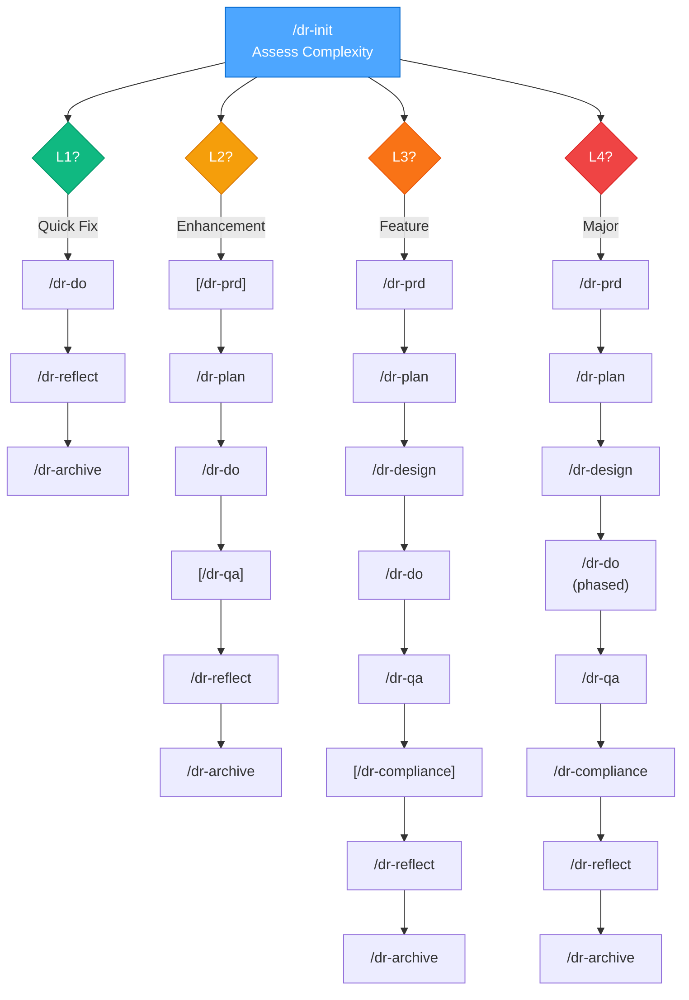

# Visual Maps — Pipeline Routing by Complexity

```mermaid
graph TD
    Init["/dr-init<br>Assess Complexity"] --> L1{"L1?"}
    Init --> L2{"L2?"}
    Init --> L3{"L3?"}
    Init --> L4{"L4?"}

    L1 -->|"Quick Fix"| Do1["/dr-do"]
    Do1 --> Reflect1["/dr-reflect"]
    Reflect1 --> Archive1["/dr-archive"]

    L2 -->|"Enhancement"| PRD2["[/dr-prd]"]
    PRD2 --> Plan2["/dr-plan"]
    Plan2 --> Do2["/dr-do"]
    Do2 --> QA2["[/dr-qa]"]
    QA2 --> Reflect2["/dr-reflect"]
    Reflect2 --> Archive2["/dr-archive"]

    L3 -->|"Feature"| PRD3["/dr-prd"]
    PRD3 --> Plan3["/dr-plan"]
    Plan3 --> Design3["/dr-design"]
    Design3 --> Do3["/dr-do"]
    Do3 --> QA3["/dr-qa"]
    QA3 --> Compliance3["[/dr-compliance]"]
    Compliance3 --> Reflect3["/dr-reflect"]
    Reflect3 --> Archive3["/dr-archive"]

    L4 -->|"Major"| PRD4["/dr-prd"]
    PRD4 --> Plan4["/dr-plan"]
    Plan4 --> Design4["/dr-design"]
    Design4 --> Do4["/dr-do<br>(phased)"]
    Do4 --> QA4["/dr-qa"]
    QA4 --> Comp4["/dr-compliance"]
    Comp4 --> Reflect4["/dr-reflect"]
    Reflect4 --> Archive4["/dr-archive"]

    style Init fill:#4da6ff,stroke:#0066cc,color:white
    style L1 fill:#10b981,stroke:#059669,color:white
    style L2 fill:#f59e0b,stroke:#d97706,color:white
    style L3 fill:#f97316,stroke:#ea580c,color:white
    style L4 fill:#ef4444,stroke:#dc2626,color:white
```

Brackets `[]` indicate stages that are conditional at that complexity level.
