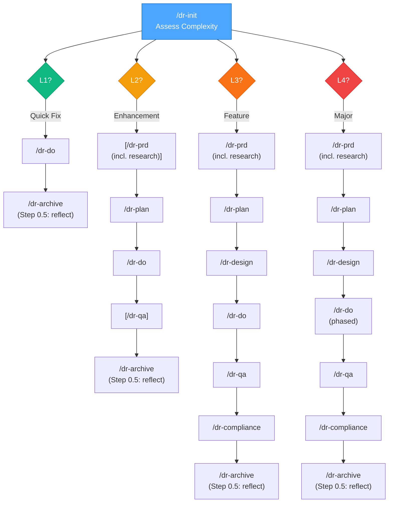
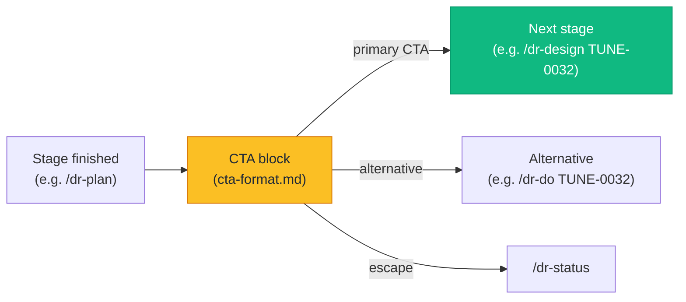
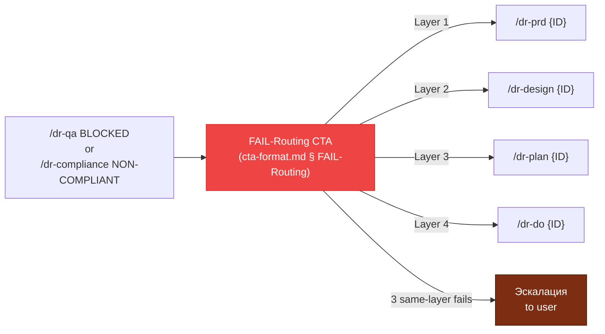

# Visual Maps — Pipeline Routing by Complexity

Brackets `[]` indicate stages that are conditional at that complexity level. `/dr-archive` always runs **Step 0.5 reflection** internally (non-skippable, mandatory since v1.10.0 / TUNE-0013); this is not shown as a separate pipeline node because it cannot be skipped.

## CTA Decision Points (TUNE-0032 / v1.16.0)

Every transition between stages MUST emit a canonical CTA block per `$HOME/.claude/skills/cta-format.md`. Diagram representation:

The CTA block always includes:
1. Resolved task ID
2. ≤5 numbered options (sweet spot 3)
3. Exactly one `**рекомендуется**` primary marker
4. `---` HR wrapping (top + bottom)
5. `**Другие активные задачи:**` Variant B menu when >1 active tasks

### Failure Routing Decision Point

When `/dr-qa` returns BLOCKED or `/dr-compliance` returns NON-COMPLIANT, the FAIL-Routing CTA variant routes back to the earliest failed layer:

Source: TUNE-0032 — unified CTA spec, v1.16.0.
