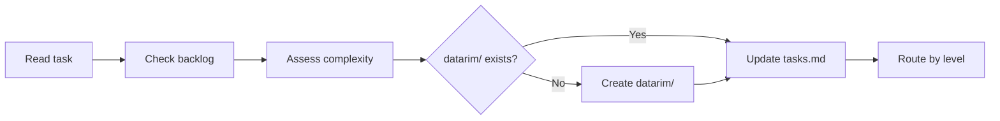
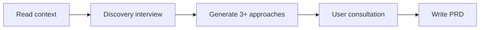
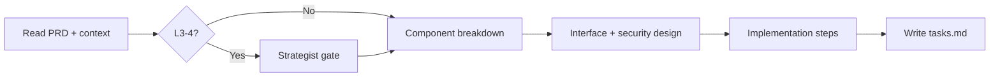
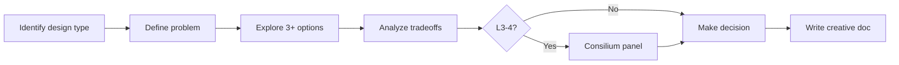
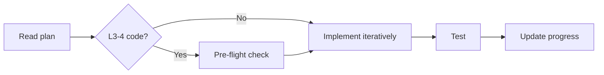
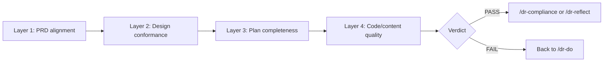
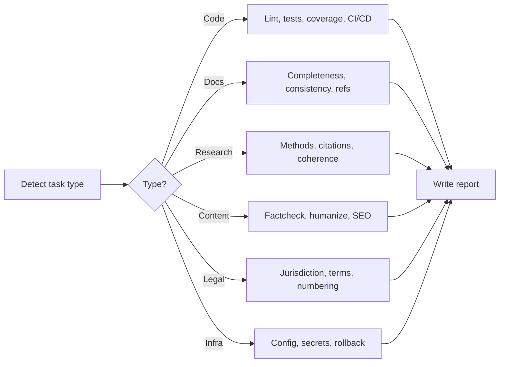
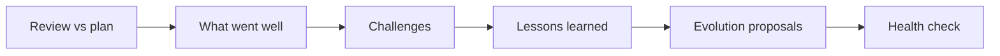
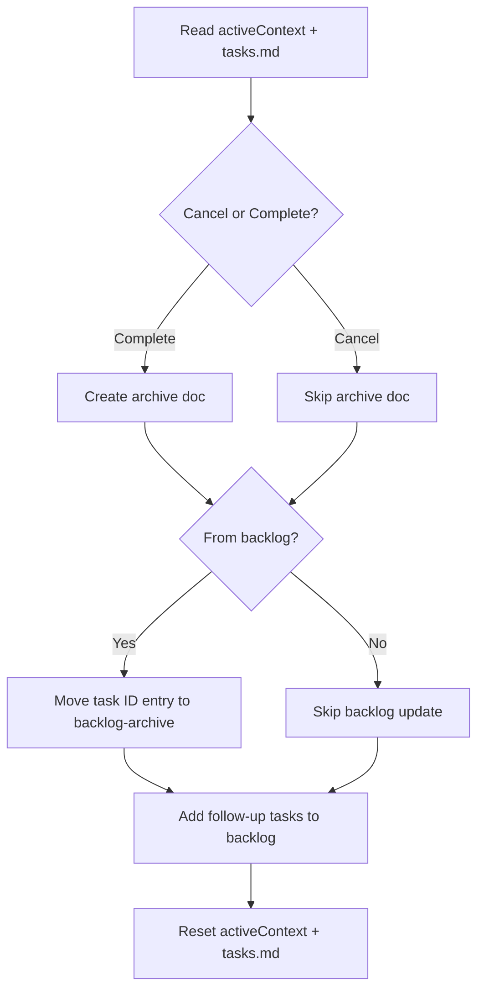

# Visual Maps — Stage Process Flows

## /dr-init

```mermaid
graph LR
    A["Read task"] --> B["Check backlog"]
    B --> C["Assess complexity"]
    C --> D{"datarim/ exists?"}
    D -->|No| E["Create datarim/"]
    D -->|Yes| F["Update tasks.md"]
    E --> F
    F --> G["Route by level"]
```

## /dr-prd

```mermaid
graph LR
    A["Read context"] --> B["Discovery interview"]
    B --> C["Generate 3+ approaches"]
    C --> D["User consultation"]
    D --> E["Write PRD"]
```

## /dr-plan

```mermaid
graph LR
    A["Read PRD + context"] --> B{"L3-4?"}
    B -->|Yes| C["Strategist gate"]
    B -->|No| D["Component breakdown"]
    C --> D
    D --> E["Interface + security design"]
    E --> F["Implementation steps"]
    F --> G["Write tasks.md"]
```

## /dr-design

```mermaid
graph LR
    A["Identify design type"] --> B["Define problem"]
    B --> C["Explore 3+ options"]
    C --> D["Analyze tradeoffs"]
    D --> E{"L3-4?"}
    E -->|Yes| F["Consilium panel"]
    E -->|No| G["Make decision"]
    F --> G
    G --> H["Write creative doc"]
```

## /dr-do

```mermaid
graph LR
    A["Read plan"] --> B{"L3-4 code?"}
    B -->|Yes| C["Pre-flight check"]
    B -->|No| D["Implement iteratively"]
    C --> D
    D --> E["Test"]
    E --> F["Update progress"]
```

## /dr-qa

```mermaid
graph LR
    A["Layer 1: PRD alignment"] --> B["Layer 2: Design conformance"]
    B --> C["Layer 3: Plan completeness"]
    C --> D["Layer 4: Code/content quality"]
    D --> E{"Verdict"}
    E -->|PASS| F["/dr-compliance or /dr-reflect"]
    E -->|FAIL| G["Back to /dr-do"]
```

## /dr-compliance

```mermaid
graph LR
    A["Detect task type"] --> B{"Type?"}
    B -->|Code| C["Lint, tests, coverage, CI/CD"]
    B -->|Docs| D["Completeness, consistency, refs"]
    B -->|Research| E["Methods, citations, coherence"]
    B -->|Content| F["Factcheck, humanize, SEO"]
    B -->|Legal| G["Jurisdiction, terms, numbering"]
    B -->|Infra| H["Config, secrets, rollback"]
    C & D & E & F & G & H --> I["Write report"]
```

## /dr-reflect

```mermaid
graph LR
    A["Review vs plan"] --> B["What went well"]
    B --> C["Challenges"]
    C --> D["Lessons learned"]
    D --> E["Evolution proposals"]
    E --> F["Health check"]
```

## /dr-archive

```mermaid
graph TD
    A["Read activeContext + tasks.md"] --> B{"Cancel or Complete?"}
    B -->|Complete| C["Create archive doc"]
    B -->|Cancel| H["Skip archive doc"]
    C --> D{"From backlog?"}
    H --> D
    D -->|Yes| E["Move task ID entry to backlog-archive"]
    D -->|No| F["Skip backlog update"]
    E --> G["Add follow-up tasks to backlog"]
    F --> G
    G --> I["Reset activeContext + tasks.md"]
```
