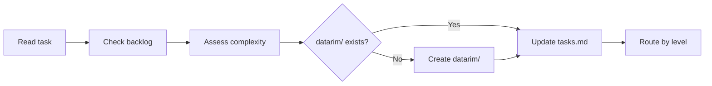
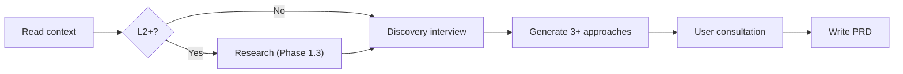
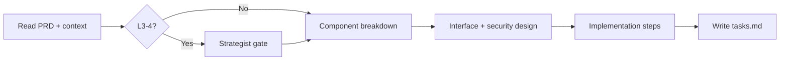
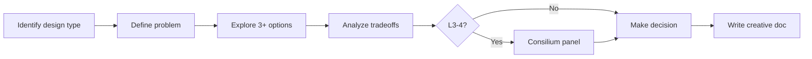
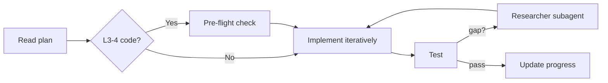
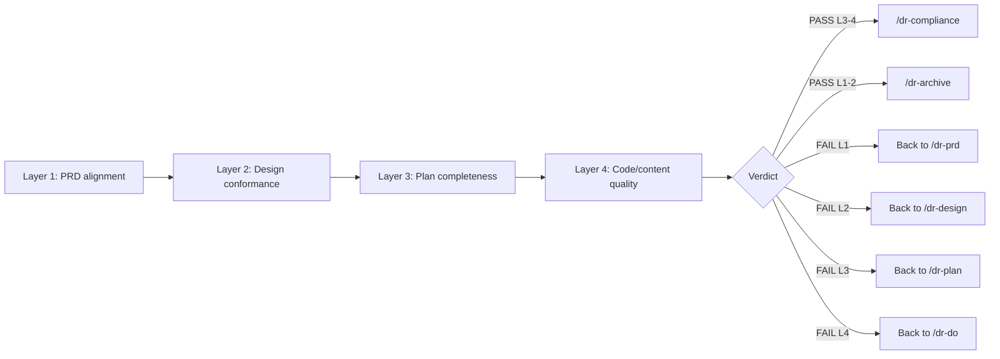
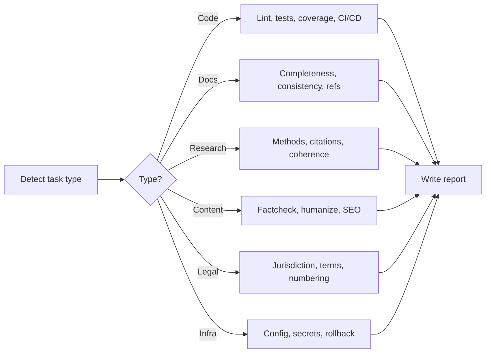
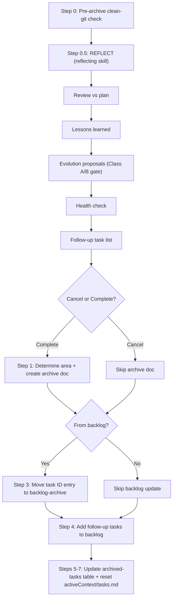

# Visual Maps — Stage Process Flows

## /dr-init

## /dr-prd

## /dr-plan

## /dr-design

## /dr-do

## /dr-qa

## /dr-compliance

## /dr-archive

Reflection runs as **Step 0.5** (mandatory, non-skippable) inside `/dr-archive` via the `reflecting` skill. Archive cannot proceed if reflection fails or Class A proposals are rejected.

