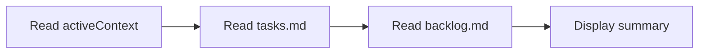
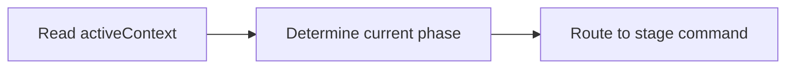

# Visual Maps — Utility Flows and Dependencies

## Utility Command Flows

### /dr-status

### /dr-continue

## Command — Agent Relationships

```mermaid
graph TD
    subgraph "Pipeline Commands"
        init["/dr-init"]
        prd["/dr-prd"]
        plan["/dr-plan"]
        design["/dr-design"]
        do["/dr-do"]
        qa["/dr-qa"]
        compliance["/dr-compliance"]
        archive["/dr-archive<br>(Step 0.5: reflect)"]
    end

    subgraph "Content Commands"
        write["/dr-write"]
        edit["/dr-edit"]
        publish["/dr-publish"]
        factcheck_cmd["/factcheck"]
        humanize_cmd["/humanize"]
    end

    subgraph "Management Commands"
        addskill["/dr-addskill"]
        optimize["/dr-optimize"]
        dream_cmd["/dr-dream"]
    end

    subgraph "Utility Commands"
        status["/dr-status"]
        continue_cmd["/dr-continue"]
        help["/dr-help"]
    end

    subgraph "Agents"
        planner["planner"]
        architect["architect"]
        developer["developer"]
        reviewer["reviewer"]
        comp_agent["compliance"]
        strategist["strategist"]
        writer_agent["writer"]
        editor_agent["editor"]
        skill_creator["skill-creator"]
        optimizer_agent["optimizer"]
        librarian["librarian"]
        security_agent["security"]
        sre_agent["sre"]
        devops_agent["devops"]
        code_simp["code-simplifier"]
        researcher["researcher"]
    end

    init --> planner
    prd --> architect
    prd -.->|"Phase 1.3"| researcher
    plan --> planner
    plan -.->|"L3-4"| strategist
    design --> architect
    design -.->|"L3-4"| security_agent
    design -.->|"L3-4"| sre_agent
    do --> developer
    do -.->|"gap discovery"| researcher
    do -.-> devops_agent
    qa --> reviewer
    qa -.-> security_agent
    compliance --> comp_agent
    compliance -.-> code_simp
    archive --> planner
    archive -.->|"Step 0.5"| reviewer
    write --> writer_agent
    edit --> editor_agent
    publish --> writer_agent
    factcheck_cmd --> editor_agent
    humanize_cmd --> editor_agent
    addskill --> skill_creator
    optimize --> optimizer_agent
    dream_cmd --> librarian
```

## Agent — Skill Dependencies

```mermaid
graph LR
    subgraph "Agents"
        planner["planner"]
        architect["architect"]
        developer["developer"]
        reviewer["reviewer"]
        comp_agent["compliance"]
        writer_agent["writer"]
        editor_agent["editor"]
        skill_creator["skill-creator"]
        optimizer_agent["optimizer"]
        librarian["librarian"]
        strategist["strategist"]
        devops_agent["devops"]
        sre_agent["sre"]
        security_agent["security"]
        researcher_agent["researcher"]
    end

    subgraph "Skills"
        sys["datarim-system"]
        aiq["ai-quality"]
        sec["security"]
        test["testing"]
        perf["performance"]
        tech["tech-stack"]
        cons["consilium"]
        disc["discovery"]
        evo["evolution"]
        refl["reflecting"]
        writ["writing"]
        drm["dream"]
        comp_sk["compliance"]
        fc["factcheck"]
        hum["humanize"]
        pub["publishing"]
        util["utilities"]
        vmap["visual-maps"]
        research_wf["research-workflow"]
        init_task["init-task-persistence"]
        expect_sk["expectations-checklist"]
        play_sk["playwright-qa"]
        human_sk["human-summary"]
    end

    planner --> sys & aiq & tech & init_task
    architect --> sys & tech & perf & sec & cons & init_task & expect_sk
    developer --> sys & aiq & test & init_task
    reviewer --> sys & sec & test & refl & evo & init_task & expect_sk & play_sk & human_sk
    comp_agent --> sys & comp_sk & expect_sk & human_sk
    writer_agent --> sys & writ & fc & pub
    editor_agent --> sys & fc & hum & writ
    skill_creator --> sys & evo & writ
    optimizer_agent --> sys & evo
    librarian --> sys & drm
    strategist --> sys
    devops_agent --> sys & tech & sec
    sre_agent --> sys & perf & sec
    security_agent --> sys & sec & comp_sk
    researcher_agent --> sys & research_wf & tech
```

## New v2.8.0 Skills (TUNE-0210)

Four operator-facing skills introduced in v2.8.0 augment the canonical agent ↔ skill graph above:

- **`init-task-persistence`** — schema and lifecycle contract for the verbatim operator brief. Loaded by every pipeline command at its first read step (planner / architect / developer / reviewer).
- **`expectations-checklist`** — flat-markdown wishlist schema (Option B from creative). Architect writes at `/dr-prd`, planner writes at `/dr-plan` (L2 without PRD). Reviewer + compliance verify via the `--verify` validator.
- **`playwright-qa`** — frontend-touch detection + browser-pass artefact layout. Reviewer loads in `/dr-qa` Layer 4f.
- **`human-summary`** — plain-language operator recap with banlist + whitelist + escape-hatch. Reviewer + compliance + archive all emit the four-sub-section recap as Step 8.
