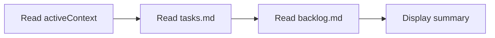
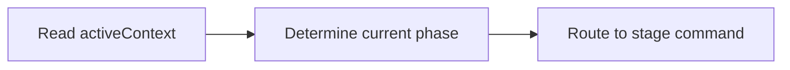

# Visual Maps — Utility Flows and Dependencies

## Utility Command Flows

### /dr-status

```mermaid
graph LR
    A["Read activeContext"] --> B["Read tasks.md"]
    B --> C["Read backlog.md"]
    C --> D["Display summary"]
```

### /dr-next

```mermaid
graph LR
    A["Read activeContext"] --> B["Determine current phase"]
    B --> C["Route to stage command"]
```

## Framework Relationships

Command → agent and agent → skill relationships are generated from the live repository.
See [`framework-architecture.md`](framework-architecture.md). Do not duplicate those inventories here.

Command sequencing is generated from `dev-tools/command-graph.yaml`.
See [`command-dependencies.md`](command-dependencies.md).
